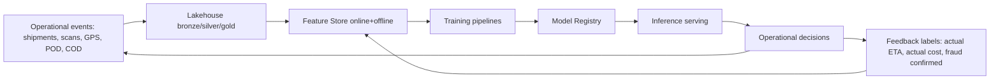
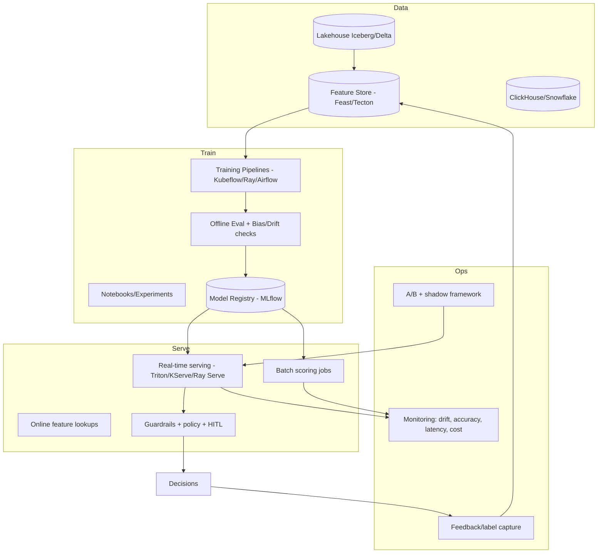
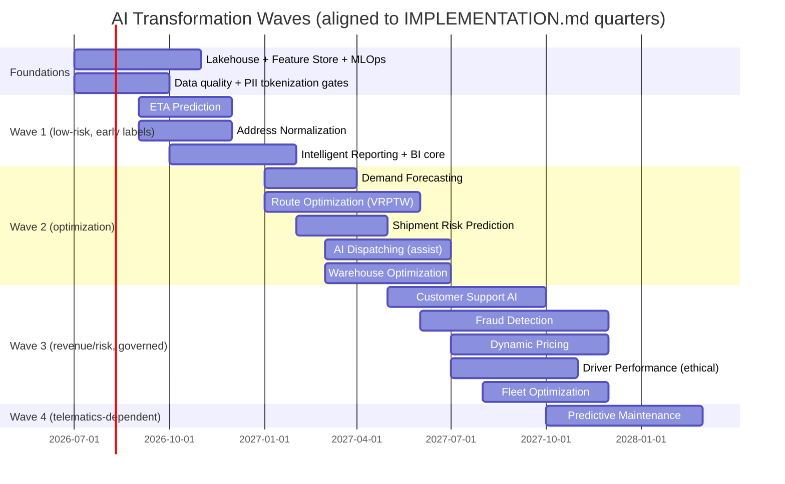

# Livraison — AI Transformation Strategy (v1.0)

> Author hat: AI Systems Architect (logistics optimization).
> Companion to BLUEPRINT.md (§11 AI Opportunities), ARCHITECTURE.md (§6.26 AI Inference, §10 data), OPERATIONS.md, AUDIT.md.
> Audience: Exec sponsors, AI/ML platform, data platform, domain engineering, finance/FinOps, security/compliance.

> Reality note: The platform is at Sprint 1 (foundation + design system). AI features depend on data that does not exist yet. This strategy therefore sequences AI **after** the data foundations it requires, and is explicit about prerequisites. Cost and ROI figures are planning-grade estimates for budgeting, not quotes or guarantees.

---

## Table of Contents

- Part I — Strategy Foundations
  1. Vision & Operating Principles
  2. The Data Flywheel & Prerequisites
  3. AI Platform (MLOps) Reference Architecture
  4. Build vs Buy vs Fine-tune Policy
  5. Responsible AI, Safety & Governance
  6. Portfolio Prioritization (value vs effort)
- Part II — The 14 AI Features (full spec each)
  1. Route Optimization
  2. Dynamic Pricing
  3. Demand Forecasting
  4. Delivery Time Prediction (ETA)
  5. Warehouse Optimization
  6. Fleet Optimization
  7. Fraud Detection
  8. Customer Support AI
  9. AI Dispatching
  10. Shipment Risk Prediction
  11. Driver Performance Analytics
  12. Predictive Maintenance
  13. Intelligent Reporting
  14. Business Intelligence
- Part III — Execution
  - Consolidated Roadmap
  - Aggregate Cost & ROI
  - KPIs & Success Metrics
  - Risks & Mitigations

---

# PART I — STRATEGY FOUNDATIONS

## 1. Vision & Operating Principles

**Vision**: Make Livraison a self-optimizing logistics network where every routing, pricing, staffing, and risk decision is data-driven, predictive, and continuously learning — compressing time and cost while raising reliability and trust.

**Operating principles**:

- **Decisions, not dashboards.** Every model must change an operational decision (route, price, assignment, hold) or it is not funded.
- **Human-in-the-loop for high-impact, irreversible actions.** Money, holds, account freezes, adverse actions require human review (AUDIT.md SPEC-005/011).
- **Baselines first.** Ship a transparent heuristic/rule baseline before ML; ML must beat the baseline on a pre-agreed metric to be promoted.
- **Shadow → canary → guarded rollout.** No model goes straight to autonomous control.
- **Privacy and residency by design.** Training data honors PII tokenization and data residency (AUDIT.md SPEC-003).
- **Cost-aware.** Track $/prediction and model ROI; retire models that don't pay.

## 2. The Data Flywheel & Prerequisites

AI value compounds only when the data foundation exists. Hard dependency chain:

**Prerequisites before any production model (gates):**

- Event backbone + tracking events flowing (ARCHITECTURE.md §9) — needed for nearly every feature.
- Lakehouse (bronze/silver/gold) + dbt models (IMPLEMENTATION.md F18.04).
- Feature store (online for low-latency serving, offline for training) — IMPLEMENTATION.md F19.01.
- Data quality + lineage (freshness/completeness tests).
- PII tokenization + residency controls in place (AUDIT.md SPEC-003).
- Label capture wired (actual delivery times, confirmed fraud, accepted quotes) — without labels, supervised models cannot improve.

**Implication:** the first AI features should be those whose labels and features arrive earliest and whose decisions are reversible (ETA, address normalization), not the riskiest (autonomous dispatch, fraud auto-action).

## 3. AI Platform (MLOps) Reference Architecture

**Standards** (apply to every feature):

- Versioned datasets, features, and models; reproducible training.
- Model cards + datasheets per model (governance).
- Shadow deployment + A/B with pre-registered success metric.
- Drift, bias, accuracy, latency, and **$/prediction** monitoring with auto-rollback (mirrors DEPLOYMENT.md canary policy).
- Feature parity between training (offline) and serving (online) to prevent training-serving skew.
- Force-sample 100% of traces for decisions affecting money/safety (OPERATIONS.md §11).

## 4. Build vs Buy vs Fine-tune Policy

- **Buy/managed** for commoditized capabilities (base LLMs, maps/traffic, geocoding fallback, speech-to-text).
- **Fine-tune/RAG** for domain-specific language tasks (support agent grounded in our KB and policies).
- **Build** for proprietary advantage where our data is the moat (ETA on our lanes, routing with our constraints, fraud on our patterns, demand on our network).
- Default to **OR-tools/open solvers** for optimization; **gradient-boosted trees** for tabular prediction (strong baselines, cheap, explainable) before deep learning.

## 5. Responsible AI, Safety & Governance

- **Risk tiering (EU AI Act-aligned)**: classify each model (minimal/limited/high-risk). Fraud and anything affecting livelihood (driver scoring) get high-risk controls: documentation, human oversight, appeal.
- **Explainability**: reason codes / feature attributions for every decision surfaced to staff or customers.
- **Fairness**: bias monitoring across protected attributes; never use protected attributes as features; audit driver/merchant scoring for disparate impact.
- **Human oversight**: HITL mandatory for adverse/irreversible actions; clear override + feedback capture.
- **Privacy**: train on tokenized/pseudonymized data; respect residency and opt-outs; no PII in prompts/logs.
- **Security**: prompt-injection defenses, output filtering, tool-use authorization for agents; adversarial testing for fraud models.
- **Review board**: pre-deployment AI review (product + security + legal + domain) for high-risk models.

## 6. Portfolio Prioritization

| Feature                      | Value     | Effort | Data readiness    | Risk            | Wave |
| ---------------------------- | --------- | ------ | ----------------- | --------------- | ---- |
| ETA Prediction               | High      | Med    | Early             | Low             | 1    |
| Address Normalization\*      | High      | Med    | Early             | Low             | 1    |
| Intelligent Reporting        | Med       | Low    | Early             | Low             | 1    |
| Business Intelligence        | Med       | Med    | Early             | Low             | 1    |
| Demand Forecasting           | High      | Med    | Medium            | Low             | 2    |
| Route Optimization           | Very High | High   | Medium            | Med             | 2    |
| AI Dispatching               | High      | High   | Medium            | Med             | 2    |
| Shipment Risk Prediction     | High      | Med    | Medium            | Med             | 2    |
| Warehouse Optimization       | Med       | Med    | Medium            | Low             | 2    |
| Customer Support AI          | High      | Med    | Medium            | Med             | 3    |
| Fraud Detection              | Very High | High   | Medium            | High            | 3    |
| Dynamic Pricing              | High      | High   | Medium            | High            | 3    |
| Driver Performance Analytics | Med       | Med    | Medium            | High (fairness) | 3    |
| Fleet Optimization           | Med       | Med    | Medium            | Low             | 3    |
| Predictive Maintenance       | Med       | Med    | Late (telematics) | Low             | 4    |

\*Address normalization is in BLUEPRINT §11.4; included as a Wave-1 enabler because it lifts many other features.

---

# PART II — THE 14 AI FEATURES

> Each feature: Business Value · Required Data · Training Data Sources · Suggested Models · Infrastructure · Cost Estimation · ROI Estimation · Implementation Roadmap.
> Cost ranges are planning-grade monthly figures for the feature's incremental AI infra/run cost at growth scale; they exclude shared platform cost. ROI is illustrative and must be validated against baselines.

## 1. Route Optimization

**Business Value**: Maximize stops/hour and on-time rate while cutting distance, fuel, and overtime. The single largest cost lever in last-mile and line-haul. Target 15–25% cost-per-shipment reduction and measurable OTD uplift (BLUEPRINT.md G2, §11.1).

**Required Data**: Stops with time windows and service times, vehicle capacities/skills, driver shifts & HOS, road network + restrictions, live + historical traffic, weather, geofences, historical actual travel/service times.

**Training Data Sources**: Historical route executions (planned vs actual), GPS breadcrumbs, telematics, maps/traffic provider history, weather archives, dispatch overrides (as feedback labels).

**Suggested Models**:

- Optimization core: VRP/VRPTW/PDPTW via **OR-Tools / VROOM / jsprit** (metaheuristics: guided local search, simulated annealing).
- ML predictors feeding the solver: **gradient-boosted regressors** for travel-time and service-time estimation; graph-based ETA.
- Incremental/online re-optimization for re-routes.

**Infrastructure**: CPU-heavy solver worker pool (KEDA-scaled on queue depth); separate **batch tier** (overnight planning) and **real-time tier** (re-route < seconds); feature store for predicted times; caching of stable sub-routes (addresses AUDIT.md SPEC-014).

**Cost Estimation**: Compute-bound. ~$8k–$30k/mo at growth scale (solver workers + travel-time models); scales with fleet size and re-optimization frequency.

**ROI Estimation**: Highest in the portfolio. Even 10–15% distance/overtime reduction on a large fleet typically returns multiples of cost within 1–2 quarters. Illustrative: if fuel+labor for last-mile is the dominant variable cost, a 12% efficiency gain dwarfs the infra cost.

**Implementation Roadmap**:

- Phase 0: heuristic baseline (nearest-neighbor + 2-opt) — already F09.03.
- Phase 1: VRPTW solver with capacity/HOS/window constraints (F09.04); shadow vs baseline.
- Phase 2: ML-predicted travel/service times feed the solver; A/B for stops/hour + OTD uplift.
- Phase 3: real-time incremental re-optimization; fairness constraints (no driver overload).

## 2. Dynamic Pricing

**Business Value**: Optimize margin and win-rate per quote; surge pricing in peak windows; targeted discounts to grow volume without eroding margin. Protects against underpricing loss-making lanes.

**Required Data**: Rate cards, historical quotes + accept/reject outcomes, cost-to-serve per lane, competitor signals (where lawful), capacity/utilization, demand forecasts, customer segment/tier, elasticity history.

**Training Data Sources**: Quote logs with outcomes, settlement/cost data, lane cost models, demand forecasts (feature 3), seasonality calendars.

**Suggested Models**:

- **Win-rate / price-elasticity** models (gradient-boosted classifiers, Bayesian elasticity).
- **Constrained price optimization** (maximize expected margin = price × P(accept) − cost) with guardrails (floors/ceilings, fairness, regulatory).
- Contextual bandits for discount targeting.

**Infrastructure**: Real-time inference (<200 ms) at quote time via the existing Pricing service calling AI Inference; offline elasticity training; strict guardrail policy layer.

**Cost Estimation**: ~$4k–$15k/mo at growth scale (mostly training + low-latency serving).

**ROI Estimation**: High but **high-risk** (mispricing or perceived unfairness damages trust). Even a 1–3% margin improvement on large GMV is material. Must run long shadow + A/B with strict guardrails before any automation.

**Implementation Roadmap**:

- Phase 0: deterministic rate cards (exists, F08.x) as the floor/guardrail.
- Phase 1: win-rate model in shadow; recommend (don't set) prices to sales.
- Phase 2: guarded automated pricing for selected segments with floors/ceilings; A/B on margin + win-rate.
- Phase 3: surge windows tied to demand forecast; discount bandits.

## 3. Demand Forecasting

**Business Value**: Right-size staffing, fleet, and hub capacity; reduce overtime and missed pickups; feed pricing and routing. Directly improves cost and reliability during peaks.

**Required Data**: Historical volumes by lane/branch/hour, merchant pipelines/promos, holiday calendars, weather, macro signals, marketing calendars.

**Training Data Sources**: Shipment history, pickup history, merchant-declared forecasts, public holiday/weather datasets.

**Suggested Models**: Hierarchical time-series — **Temporal Fusion Transformer / DeepAR / Prophet**, with reconciliation across aggregation levels (network → region → branch → hour). Quantile forecasts for capacity buffers.

**Infrastructure**: Scheduled batch training/scoring (Airflow/Kubeflow); forecasts published to feature store + BI; modest compute.

**Cost Estimation**: ~$3k–$10k/mo at growth scale (batch).

**ROI Estimation**: High. Better staffing/fleet alignment reduces overtime and idle capacity; typical labor-planning savings recoup cost quickly. Feeds routing/pricing, amplifying their ROI.

**Implementation Roadmap**:

- Phase 1: network/region forecasts (WAPE/MAPE targets); BI dashboards.
- Phase 2: branch/hour granularity feeding workforce + fleet planning.
- Phase 3: scenario simulation (what-if for promos/peaks); integrate with surge pricing.

## 4. Delivery Time Prediction (ETA)

**Business Value**: Accurate promised + dynamic ETAs reduce failed deliveries, WISMO ("where is my order") support contacts, and SLA breaches; improves NPS. A foundational, low-risk, high-leverage model (BLUEPRINT.md §11.2).

**Required Data**: Lane history, current location/trajectory, traffic, weather, time-of-day, hub backlogs, package counts, driver/branch performance.

**Training Data Sources**: Historical shipment timestamps (picked→delivered), tracking events, traffic/weather archives, branch throughput logs.

**Suggested Models**: **Gradient-boosted trees** + temporal features; **quantile regression** for calibrated intervals (P50/P80/P95). Optionally graph/sequence models later.

**Infrastructure**: Real-time inference triggered by tracking events; recompute on event triggers; online feature lookups; lightweight, cheap to serve.

**Cost Estimation**: ~$2k–$8k/mo at growth scale.

**ROI Estimation**: Strong and early. Reduced WISMO tickets (support cost), fewer failed first attempts (re-delivery cost), higher NPS. Often the **best first AI investment** because labels (actual delivery time) arrive automatically.

**Implementation Roadmap**:

- Phase 1: lane-level baseline + GBM point ETA; MAE target ≥ 20% better than heuristic.
- Phase 2: calibrated intervals; customer-facing dynamic ETA; recompute on events.
- Phase 3: feed delay prediction (feature 10) and proactive notifications.

## 5. Warehouse Optimization

**Business Value**: Increase sort throughput, reduce mis-sorts and dock-to-stock time, optimize slotting and labor allocation, smooth dock scheduling. Improves hub KPIs (BLUEPRINT.md §10.3).

**Required Data**: Inbound/outbound volumes, sort scans, mis-sort events, bin/zone layouts, dock schedules, staffing rosters, equipment status, parcel dimensions/weights.

**Training Data Sources**: Sortation logs, throughput history, labor schedules, dock arrival/departure logs, layout maps.

**Suggested Models**:

- **Slotting/assignment optimization** (MILP/heuristics) for bin and lane allocation.
- **Labor & dock scheduling** optimization (constraint solvers) driven by demand forecast.
- **Vision AI** (later) for damage detection and volumetric capture (BLUEPRINT.md §11.9).

**Infrastructure**: Batch optimization (shift planning) + near-real-time guidance to handheld app; optional edge vision inference at hubs (GPU at hub or cloud).

**Cost Estimation**: ~$3k–$12k/mo at growth scale (excl. hub camera hardware for vision).

**ROI Estimation**: Medium-high. Throughput and mis-sort improvements reduce labor cost and downstream delivery failures. Vision adds capex but reduces damage claims and weight/dim disputes.

**Implementation Roadmap**:

- Phase 1: throughput analytics + mis-sort root-cause; demand-driven labor planning.
- Phase 2: slotting/lane optimization; dock scheduling.
- Phase 3: vision pilots (damage, dimensions) at 1–2 hubs.

## 6. Fleet Optimization

**Business Value**: Optimize vehicle mix, assignment, utilization, and fuel; reduce empty miles via backhaul matching; lower emissions. Complements route optimization at the asset level.

**Required Data**: Vehicle capacities/types/costs, telematics (fuel, mileage, idling), maintenance status, route demand, backhaul opportunities, emissions factors.

**Training Data Sources**: Telematics history, fuel logs, maintenance records, route/trip history.

**Suggested Models**: Assignment/matching optimization (MILP), **backhaul matching** (graph matching), fuel-efficiency regression, utilization forecasting.

**Infrastructure**: Batch optimization + telematics ingest pipeline; integrates with dispatch and routing.

**Cost Estimation**: ~$3k–$10k/mo at growth scale (depends on telematics integration).

**ROI Estimation**: Medium. Empty-mile reduction and right-sized vehicle assignment cut fuel and capital costs; emissions reduction supports sustainability reporting.

**Implementation Roadmap**:

- Phase 1: utilization analytics + vehicle-type assignment recommendations.
- Phase 2: backhaul matching; fuel-efficiency insights.
- Phase 3: integrate with route/dispatch for joint optimization.

## 7. Fraud Detection

**Business Value**: Reduce losses from COD/cash fraud, package theft, return fraud, fake POD, account takeover, and collusion. Direct bottom-line protection in a COD-heavy model (BLUEPRINT.md §11.6); high-risk, requires governance.

**Required Data**: Transactions, COD flows, POD evidence (photos/signatures/geo), scan patterns, login/device signals, return histories, driver/merchant graphs.

**Training Data Sources**: Confirmed fraud cases (labels — scarce, precious), chargebacks, investigation outcomes, POD media, auth logs, device fingerprints.

**Suggested Models**:

- **Anomaly detection** (isolation forest, autoencoders) for cold-start.
- **Gradient-boosted classifiers** as labels accumulate.
- **Graph neural networks** for collusion rings (driver–merchant–address graphs).
- **Computer vision** for POD authenticity (perceptual-hash reuse, EXIF anomalies, manipulation hints) — corroborates AUDIT.md SPEC-011.

**Infrastructure**: Real-time scoring on transactions/POD + batch graph analysis; **HITL review queue**; case management integration; strict audit. High-risk governance per Part I §5.

**Cost Estimation**: ~$6k–$20k/mo at growth scale (real-time + graph + vision).

**ROI Estimation**: Very high if fraud losses are material; even modest loss reduction pays for the program. **But** false positives harm legitimate drivers/merchants — measure precision/recall, require human review for adverse actions, provide appeals.

**Implementation Roadmap**:

- Phase 1: rules + anomaly detection in shadow; build the review queue + label loop.
- Phase 2: supervised classifiers; POD vision authenticity checks.
- Phase 3: graph models for collusion; guarded auto-actions (holds) with HITL + appeal.

## 8. Customer Support AI

**Business Value**: Deflect common inquiries (WISMO, reschedule, redirect), draft agent replies, summarize tickets/calls, auto-classify and prioritize, multilingual (incl. Arabic dialects). Lowers cost-per-contact and handle time, raises CSAT (BLUEPRINT.md §11.7).

**Required Data**: KB articles, policies, ticket/chat/call transcripts, shipment context, FAQ outcomes, resolution data.

**Training Data Sources**: Historical tickets + resolutions, KB, call transcripts (redacted), CSAT outcomes.

**Suggested Models**: **RAG over KB + shipment data** with a managed LLM (buy base, fine-tune/prompt for domain); intent classification (transformers); summarization; **tool-use** for safe actions (track, reschedule) under authorization.

**Infrastructure**: LLM serving (managed API or self-hosted GPU), vector store for RAG, **guardrails** (PII redaction, prompt-injection defense, tool authorization), HITL handoff. Confidence thresholds; no hallucinated commitments (AUDIT.md SPEC-005).

**Cost Estimation**: ~$5k–$25k/mo at growth scale (token/serving costs scale with volume; self-hosting trades infra for per-token cost).

**ROI Estimation**: High. Containment of even 30–50% of routine contacts materially cuts support cost; agent-assist reduces handle time. Guardrails are non-negotiable to avoid wrong commitments.

**Implementation Roadmap**:

- Phase 1: agent-assist (suggested replies, summaries) + auto-classification — low risk.
- Phase 2: customer self-serve for read-only intents (tracking, FAQs).
- Phase 3: action-taking (reschedule/redirect) within authorized, audited scopes; multilingual expansion.

## 9. AI Dispatching

**Business Value**: Automatically assign pickups/deliveries to the best driver/vehicle considering proximity, capacity, skills, SLAs, fairness, and predicted times. Reduces dispatcher load and improves utilization + OTD.

**Required Data**: Live driver locations/status, capacities/skills, shift/HOS, open jobs with windows, predicted travel/service times (feature 4/1), historical assignment outcomes + dispatcher overrides.

**Training Data Sources**: Dispatch logs (assignments, overrides, outcomes), GPS, route executions.

**Suggested Models**: **Online assignment optimization** (combinatorial, integrates routing predictors); **reinforcement-learning** for sequential dispatch (later, carefully); fairness-constrained matching.

**Infrastructure**: Real-time decisioning service; tight integration with Routing + Driver services; dispatcher override UI feeding labels; guardrails (HOS, fairness).

**Cost Estimation**: ~$5k–$18k/mo at growth scale.

**ROI Estimation**: High. Higher stops/hour and better window compliance; frees dispatchers for exceptions. Risk: over-automation; keep dispatcher override and start in assist mode.

**Implementation Roadmap**:

- Phase 1: auto-assign suggestions to dispatchers (assist); measure acceptance.
- Phase 2: auto-assign for routine jobs with override; A/B on utilization/OTD.
- Phase 3: dynamic re-assignment on disruptions; fairness/burnout constraints.

## 10. Shipment Risk Prediction

**Business Value**: Predict which shipments will be late, failed, returned (RTO), or damaged — early enough to intervene (proactive notify, reroute, prioritize). Reduces breaches, RTO rate, and support load (extends BLUEPRINT.md §11.3).

**Required Data**: Shipment attributes, origin/destination zones, address quality, merchant history, lane performance, current trajectory vs plan, hub backlogs, weather, customer responsiveness.

**Training Data Sources**: Historical outcomes (late/failed/RTO/damaged) as labels, tracking events, address normalization outputs (feature: address), notification engagement.

**Suggested Models**: **Gradient-boosted classifiers** with probability + reason codes; survival models for time-to-failure; calibrated risk scores.

**Infrastructure**: Real-time scoring on shipment lifecycle events; risk score surfaced to ops + drives proactive notifications/holds; feature store.

**Cost Estimation**: ~$3k–$12k/mo at growth scale.

**ROI Estimation**: High. Early intervention reduces costly failures/RTOs and SLA credits; reason codes make it actionable (e.g., "bad address in this region"). Feeds merchant insights.

**Implementation Roadmap**:

- Phase 1: late/failed risk classifier with reason codes; ops alerting.
- Phase 2: proactive customer comms (reschedule/redirect) on high risk; A/B on failure reduction.
- Phase 3: RTO/damage risk; merchant-facing insights to reduce root causes.

## 11. Driver Performance Analytics

**Business Value**: Identify coaching opportunities, recognize top performers, improve safety, and fairly allocate work. Improves OTD, POD quality, safety, and retention (BLUEPRINT.md §10.4). **High fairness risk** — affects livelihoods.

**Required Data**: Stops/hour, on-time stops, success rate, POD quality, customer ratings, HOS compliance, cash variance, safety/telematics (harsh braking, speeding), tenure/area familiarity.

**Training Data Sources**: Driver KPI history, POD quality scores, ratings, telematics, incident logs.

**Suggested Models**: Transparent scoring (regularized linear / GBM with attributions); anomaly detection for safety; uplift modeling for coaching impact. **Avoid opaque models** for anything affecting pay/discipline.

**Infrastructure**: Batch analytics + scorecards in ops portal; strict governance (high-risk per Part I §5); bias monitoring; appeal process.

**Cost Estimation**: ~$2k–$6k/mo (mostly analytics).

**ROI Estimation**: Medium. Better coaching/retention and safety reduce cost; but ROI is secondary to **doing this ethically**. Misuse risks legal/labor exposure — fairness and transparency are mandatory.

**Implementation Roadmap**:

- Phase 1: transparent scorecards (descriptive, no automated penalties); driver-visible.
- Phase 2: coaching recommendations + safety anomaly alerts.
- Phase 3: fair work-allocation inputs (with constraints), human-reviewed; never fully automated discipline.

## 12. Predictive Maintenance

**Business Value**: Predict vehicle failures before they happen; reduce breakdowns, missed routes, and emergency repair cost; optimize maintenance scheduling. Depends on telematics (later-stage data).

**Required Data**: Telematics (engine, mileage, fault codes/OBD), maintenance history, vehicle age/type, usage intensity, breakdown logs.

**Training Data Sources**: Telematics streams, maintenance/repair records, failure logs, manufacturer schedules.

**Suggested Models**: **Survival analysis / remaining-useful-life** models; anomaly detection on sensor streams; classification for fault prediction.

**Infrastructure**: Telematics ingestion pipeline (depends on F06.04), time-series store, batch + streaming scoring; integrates with Fleet maintenance scheduling.

**Cost Estimation**: ~$3k–$10k/mo at growth scale (after telematics exists).

**ROI Estimation**: Medium. Avoided breakdowns prevent missed routes (delivery failures) and emergency repair premiums; extends asset life. ROI gated on telematics coverage and owned-fleet share.

**Implementation Roadmap**:

- Phase 1 (after telematics): anomaly detection on fault codes; maintenance-due predictions.
- Phase 2: RUL models; optimize maintenance scheduling vs route demand.
- Phase 3: integrate with fleet/dispatch to pre-empt assignments of at-risk vehicles.

## 13. Intelligent Reporting

**Business Value**: Auto-generate narrative insights, anomaly explanations, and natural-language report summaries; let users query data in plain language. Saves analyst time; democratizes data access (BLUEPRINT.md §10).

**Required Data**: Curated marts (gold layer), KPI definitions, metric metadata, historical reports.

**Training Data Sources**: BI marts, metric catalog, report templates, query logs.

**Suggested Models**: **LLM + semantic layer** for natural-language-to-query (text-to-SQL over a governed semantic model); anomaly explanation (statistical + LLM narration); automated insight detection.

**Infrastructure**: Semantic layer (e.g., dbt metrics/cube) + LLM with strict read-only, governed access; guardrails to prevent wrong queries; caching. Read-only — no write actions.

**Cost Estimation**: ~$3k–$12k/mo at growth scale (LLM serving + semantic layer).

**ROI Estimation**: Medium. Analyst time savings and faster decisions; risk is incorrect numbers — must ground in the governed semantic layer, never free-form SQL on raw tables. Always show the query + data lineage.

**Implementation Roadmap**:

- Phase 1: scheduled narrative summaries of standard reports; anomaly callouts.
- Phase 2: governed natural-language Q&A over the semantic layer (with shown SQL).
- Phase 3: proactive insight feeds + recommended actions.

## 14. Business Intelligence

**Business Value**: The analytical backbone — cohort analysis, lane profitability, merchant/customer segmentation, churn prediction, network optimization insights. Powers strategy and the merchant-insights product (BLUEPRINT.md §11.8).

**Required Data**: All gold-layer marts: shipments, finance, COD, returns, tickets, NPS, costs, lane economics.

**Training Data Sources**: Lakehouse marts, financial data, CRM, survey data.

**Suggested Models**: Segmentation (clustering), **churn prediction** (GBM), **cohort/retention** analysis, lane-profitability models, causal inference for RTO root-causes, uplift modeling for interventions.

**Infrastructure**: DWH (ClickHouse/Snowflake/BigQuery) + BI tools (Looker/Metabase/Superset) + dbt; mostly batch.

**Cost Estimation**: ~$4k–$15k/mo at growth scale (warehouse + BI).

**ROI Estimation**: Medium-high (compounding). Better strategic decisions, merchant retention, and a sellable merchant-insights product (potential revenue line). Foundational for nearly every other feature's evaluation.

**Implementation Roadmap**:

- Phase 1: core marts + executive/merchant dashboards (IMPLEMENTATION.md F18.x).
- Phase 2: churn + segmentation + lane profitability; merchant insights product.
- Phase 3: causal/uplift analysis; opt-in peer benchmarking; embedded analytics.

---

# PART III — EXECUTION

## Consolidated Roadmap

**Wave logic**:

- **Wave 1** ships where labels arrive automatically and decisions are reversible (ETA, address, reporting/BI). Builds trust + the data flywheel.
- **Wave 2** tackles the big cost levers (routing, demand, dispatch, risk) once enough history exists.
- **Wave 3** addresses high-value/high-risk (fraud, pricing, support actions, driver scoring) with full governance and HITL.
- **Wave 4** waits for telematics coverage (predictive maintenance).

## Aggregate Cost & ROI (planning-grade)

| Item                                                             | Range                                                                                                 |
| ---------------------------------------------------------------- | ----------------------------------------------------------------------------------------------------- |
| Shared AI platform (lakehouse, feature store, MLOps, monitoring) | ~$15k–$50k/mo at growth scale                                                                         |
| Sum of 14 features (incremental run cost)                        | ~$55k–$200k/mo at growth scale                                                                        |
| One-time build (team + setup, Waves 1–3)                         | significant; staffed by the AI Pod (IMPLEMENTATION.md §19)                                            |
| GPU/LLM (support agent, vision, large models)                    | variable; the most elastic cost — control via batching, quantization, managed-vs-self-host trade-offs |

**ROI framing**: The portfolio's value concentrates in **Route Optimization, ETA, Fraud, Demand, and Dynamic Pricing**. Combined, even conservative gains (cost-per-shipment ↓, failure/RTO ↓, fraud loss ↓, margin ↑) plausibly return multiples of total AI spend at scale. Each feature must prove ROI against its baseline before promotion; unprofitable models are retired.

## KPIs & Success Metrics (tie models to outcomes)

- Route: cost-per-shipment, stops/hour, distance/CO2, OTD.
- ETA: MAE, interval calibration, WISMO contact rate, failed-attempt rate.
- Demand: WAPE/MAPE, overtime hours, capacity utilization.
- Fraud: detected loss avoided, precision/recall, false-positive rate, appeal overturn rate.
- Pricing: margin, win-rate, churn.
- Support AI: containment rate, AHT, CSAT, escalation accuracy.
- Dispatch: utilization, window compliance, dispatcher override rate.
- Each KPI has a baseline, a target, and an owner (mirrors OPERATIONS.md SLO discipline).

## Risks & Mitigations

| Risk                                    | Mitigation                                                                                               |
| --------------------------------------- | -------------------------------------------------------------------------------------------------------- |
| No/late data foundation                 | Sequence AI after lakehouse + feature store; Wave 1 only on ready data                                   |
| Training-serving skew                   | Single feature store for both; parity tests                                                              |
| Model drift                             | Continuous monitoring + auto-rollback; scheduled retraining                                              |
| Fairness/legal (driver, fraud, pricing) | High-risk governance, bias audits, HITL, appeals, no protected attributes                                |
| LLM hallucination / wrong commitments   | RAG grounding, confidence thresholds, tool authorization, HITL handoff                                   |
| Cost overrun (GPU/LLM)                  | $/prediction monitoring, batching/quantization, managed-vs-self-host reviews, retire unprofitable models |
| Privacy/residency breach                | Tokenized training data, residency-aware pipelines, opt-out honoring                                     |
| Over-automation                         | Assist → guarded → autonomous progression; always keep human override for high-impact                    |
| Prompt injection / adversarial          | Input/output filtering, adversarial testing, least-privilege tool-use                                    |

## Closing

Livraison's AI advantage is its **proprietary operational data**: lanes, addresses, COD behavior, and delivery outcomes that no general model has. The strategy deliberately builds the data flywheel first, ships trustworthy low-risk wins (ETA, address, BI) to earn confidence and generate labels, then compounds into the high-value optimization and risk models — all under responsible-AI governance with humans in the loop where it matters.

— End of AI Transformation Strategy —
