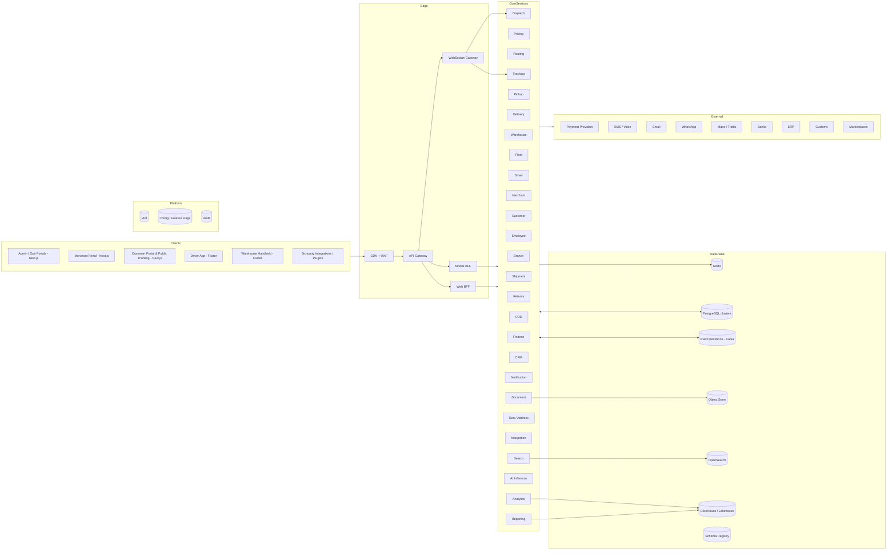
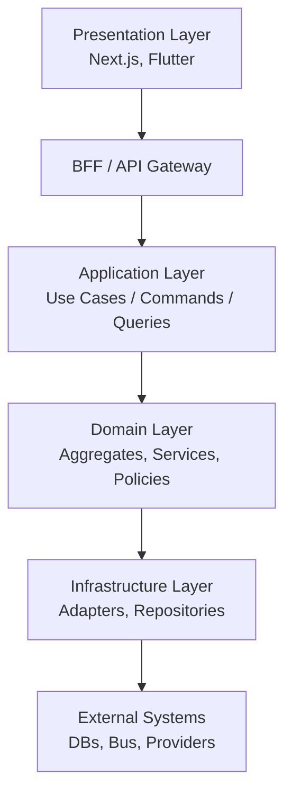
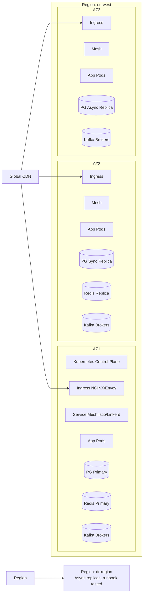
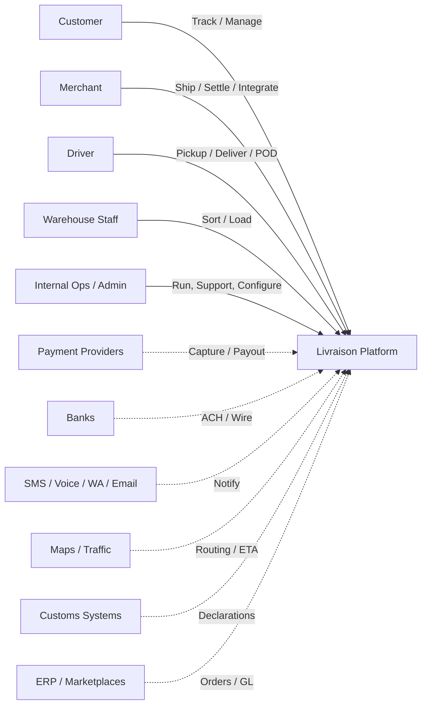
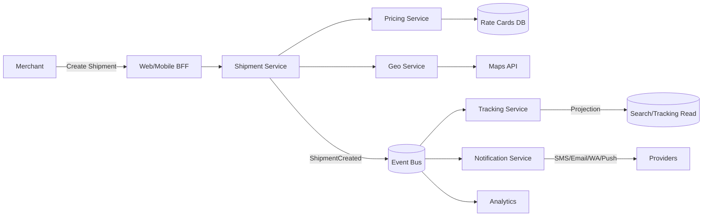
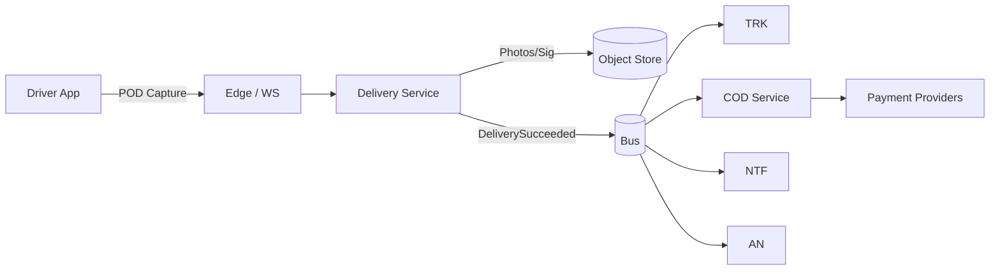
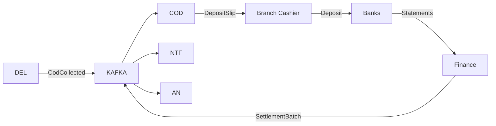
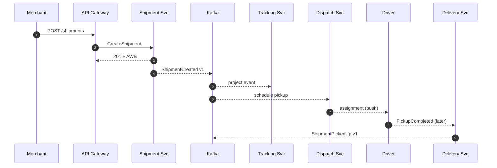

# Livraison — Enterprise Architecture & Technical Specification

## Companion to BLUEPRINT.md (v1.0)

> Scope: Implementation-ready architecture for the multi-tenant, multi-region logistics platform defined in BLUEPRINT.md.
> Audience: Principal/staff engineers, platform leads, SRE, security, data, and DevOps.
> Status: Specification. No code. Diagrams use Mermaid for portability.

---

## Table of Contents

1. System Architecture
2. Repository Architecture
3. Frontend Architecture (Next.js)
4. Mobile Architecture (Flutter)
5. Backend Architecture (Clean / DDD / CQRS)
6. Microservices Architecture
7. Database Architecture (PostgreSQL)
8. API Specification
9. Event-Driven Architecture
10. Infrastructure Architecture
11. Security Architecture
12. Observability
13. Performance Engineering
14. CI/CD & DevOps
15. Technical Standards
16. Enterprise Roadmap

---

# 1. System Architecture

## 1.1 Architecture Principles

- **Domain-aligned services**: each bounded context owns its data, schema, and lifecycle.
- **Event-first**: durable event log is the system of record for cross-service coordination; APIs are facades.
- **Polyglot persistence per context**: PostgreSQL primary; ClickHouse/Snowflake for analytics; Redis for caches; OpenSearch for search; S3-compatible object store for documents and POD; ScyllaDB/Cassandra optional for tracking event store at extreme scale.
- **Multi-region active-active for ingestion**, **active-active or active-passive for control plane** depending on data residency.
- **Zero-trust by default**: mTLS service mesh, SPIFFE/SPIRE identities, OPA policies.
- **Stateless compute**, externalized state; deterministic, idempotent operations.
- **Backwards-compatible APIs and events**; schema registry enforced.
- **Cell-based** deployments per country for blast-radius containment.

## 1.2 High-Level Architecture (Logical)



## 1.3 Logical Architecture (Layers)



## 1.4 Physical Architecture (Per Region)



## 1.5 Context Diagram (C4 Level 1)



## 1.6 Data Flow Diagrams

### Shipment Lifecycle (DFD)



### Delivery & POD (DFD)



### COD to Settlement (DFD)



## 1.7 Event Flow Diagram (sequence, simplified)



---

# 2. Repository Architecture

## 2.1 Approach

- **Monorepo** for shared types, contracts, design system, and infra modules.
- **Polyrepo** allowed only for partner SDKs and white-label customizations.
- Tooling: Turborepo or Nx for JS/TS; Bazel optional for cross-language; Melos for Flutter; Gradle/Maven multi-module for JVM.

## 2.2 Top-Level Monorepo Layout

```
livraison/
├─ apps/
│  ├─ web-admin/                # Next.js (Admin + Internal Ops)
│  ├─ web-merchant/             # Next.js (Merchant Portal)
│  ├─ web-customer/             # Next.js (Public Tracking + Customer Portal)
│  ├─ web-developer/            # Next.js (Developer Portal)
│  ├─ mobile-driver/            # Flutter (Driver App)
│  └─ mobile-warehouse/         # Flutter (Handheld)
├─ services/
│  ├─ iam/                      # AuthN, AuthZ, Sessions
│  ├─ user/
│  ├─ employee/
│  ├─ driver/
│  ├─ merchant/
│  ├─ customer/
│  ├─ branch/
│  ├─ warehouse/
│  ├─ fleet/
│  ├─ shipment/
│  ├─ pricing/
│  ├─ routing/
│  ├─ dispatch/
│  ├─ pickup/
│  ├─ delivery/
│  ├─ tracking/
│  ├─ returns/
│  ├─ cod/
│  ├─ finance/
│  ├─ crm/
│  ├─ notification/
│  ├─ document/
│  ├─ geo/
│  ├─ integration/
│  ├─ search/
│  ├─ ai-inference/
│  ├─ analytics/
│  ├─ reporting/
│  ├─ audit/
│  ├─ config/                   # feature flags, tenant config
│  ├─ webhooks/
│  └─ bff-web/  bff-mobile/     # backend-for-frontend gateways
├─ packages/                    # shared libs (TS/JS)
│  ├─ design-system/            # Tailwind tokens, primitives, components
│  ├─ ui-icons/
│  ├─ ui-charts/
│  ├─ ui-maps/
│  ├─ ui-logistics/             # logistics widgets
│  ├─ sdk-js/                   # public SDK
│  ├─ sdk-types/                # shared types from contracts
│  ├─ contracts/                # OpenAPI, AsyncAPI, Protobuf, Avro
│  ├─ eslint-config/
│  ├─ tsconfig/
│  ├─ test-utils/
│  └─ feature-flags-client/
├─ libs/                        # shared libs per language
│  ├─ kotlin/                   # if JVM services exist
│  ├─ go/                       # if Go services exist
│  ├─ python/                   # AI/data services
│  └─ dart/                     # shared for Flutter apps
├─ infra/
│  ├─ terraform/                # cloud infra
│  ├─ kubernetes/               # base manifests / charts
│  ├─ helm/                     # charts per service
│  ├─ argo/                     # ArgoCD apps (GitOps)
│  ├─ kafka/                    # cluster + topics + ACLs
│  ├─ postgres/                 # operators, params, backups
│  ├─ redis/                    # operators
│  ├─ opensearch/
│  ├─ object-store/
│  └─ observability/            # otel collectors, dashboards, alerts
├─ docs/
│  ├─ architecture/             # ADRs, C4, decisions
│  ├─ runbooks/
│  ├─ playbooks/                # incident, on-call, security
│  ├─ api/                      # generated API docs
│  ├─ sdks/
│  ├─ adr/                      # Architecture Decision Records
│  ├─ data/                     # data dictionary, lineage
│  └─ guides/                   # how-to guides
├─ tools/
│  ├─ scripts/
│  ├─ codegen/                  # OpenAPI/Proto/Avro generators
│  ├─ migrations/               # cross-service migration tools
│  └─ load-testing/             # k6, Locust scenarios
├─ .github/  .gitlab/           # workflows
├─ .changeset/                  # versioning for packages
├─ turbo.json | nx.json
├─ pnpm-workspace.yaml | package.json
├─ Makefile
└─ README.md
```

## 2.3 Service Internal Structure (Clean / Hexagonal)

Each service (e.g., `services/shipment/`) follows the same structure to reduce cognitive load.

```
shipment/
├─ src/
│  ├─ domain/                   # Aggregates, Entities, VOs, Domain Events, Domain Services, Policies
│  │  ├─ model/
│  │  ├─ events/
│  │  ├─ services/
│  │  └─ policies/
│  ├─ application/              # Use cases (Commands/Queries), DTOs, Sagas
│  │  ├─ commands/
│  │  ├─ queries/
│  │  ├─ handlers/
│  │  ├─ sagas/
│  │  ├─ ports/                 # Inbound/outbound interfaces
│  │  └─ dtos/
│  ├─ infrastructure/           # Adapters
│  │  ├─ persistence/           # Repository impls (Postgres)
│  │  ├─ messaging/             # Kafka producers/consumers
│  │  ├─ http/                  # External HTTP clients
│  │  ├─ cache/
│  │  ├─ search/
│  │  ├─ files/                 # S3
│  │  └─ telemetry/
│  ├─ interfaces/               # Inbound transports
│  │  ├─ http/                  # REST controllers
│  │  ├─ grpc/                  # gRPC services
│  │  ├─ websocket/
│  │  └─ subscribers/           # event consumers
│  ├─ config/
│  └─ main/                     # bootstrap
├─ tests/
│  ├─ unit/
│  ├─ integration/
│  ├─ contract/                 # Pact, schema tests
│  ├─ e2e/
│  └─ load/
├─ migrations/                  # SQL versioned migrations
├─ openapi.yaml | proto/        # contracts source-of-truth
├─ asyncapi.yaml                # event contracts
├─ Dockerfile
├─ Helm chart link
└─ README.md
```

## 2.4 Documentation Structure

- `docs/architecture/`: C4 diagrams (Mermaid + Structurizr DSL), ADRs, target/transition states.
- `docs/runbooks/`: Per-service runbooks with on-call procedures.
- `docs/playbooks/`: Incident, security incident, DR drill, business continuity.
- `docs/api/`: Auto-generated API references; versioned.
- `docs/data/`: Data dictionary, lineage, retention/PII classification.
- `docs/guides/`: Onboarding, "how to add a service," "how to add a country," "how to add an integration."

---

# 3. Frontend Architecture (Next.js)

## 3.1 App-by-App Strategy

- Three primary Next.js apps: `web-admin`, `web-merchant`, `web-customer`. Optionally `web-developer`.
- All share `packages/design-system`, `packages/sdk-types`, `packages/sdk-js`.
- All apps are **Next.js 14+ with App Router**, **React Server Components (RSC)**, **Edge runtime** for lightweight pages, **Node runtime** for heavy data routes.

## 3.2 Routing Strategy

- App Router with `app/` directory.
- **Route groups** for layout segmentation, e.g., `app/(public)/...` and `app/(auth)/...`.
- **Parallel routes** for split panels (e.g., dispatch board + drawer).
- **Intercepting routes** for modals.
- **Server-only routes** for sensitive ops; **Edge** for tracking and public pages.
- **Middleware** for tenant resolution, locale, auth gates, A/B, feature flags.
- **Internationalization** via `app/[locale]/...`; CLDR-aware; RTL handled by `dir` and tokens.

Example route map (Admin app):

```
app/
├─ [locale]/
│  ├─ (auth)/sign-in
│  ├─ (auth)/mfa
│  ├─ (admin)/dashboard
│  ├─ (admin)/tenants/[id]
│  ├─ (admin)/merchants/[id]
│  ├─ (admin)/finance/{invoices,settlements,payouts}
│  ├─ (ops)/shipments/[awb]
│  ├─ (ops)/dispatch
│  ├─ (ops)/warehouse/{inbound,sortation,outbound}
│  └─ (ops)/support/tickets/[id]
└─ api/                          # Route handlers (BFF where needed)
```

## 3.3 Component Hierarchy

- `app/` pages and layouts (Server Components by default).
- `components/` per app: feature components (Client when interactive), composed from `packages/design-system` primitives.
- `features/` (optional): vertical slices with hooks, components, queries, types.
- Strict separation: server data fetching in `app/` and route handlers; client components only when necessary.
- Server Actions for mutations where appropriate; otherwise REST/gRPC via BFF.

## 3.4 Design System Architecture

- `packages/design-system`:
  - **Tokens** (TypeScript + CSS variables): color, spacing (8pt), typography, radius, shadow, motion.
  - **Primitives**: Button, Input, Select, Tabs, Dialog, Drawer, Popover, Tooltip, Toast, Table, Skeleton, etc., based on Radix UI + Tailwind.
  - **Patterns**: PageHeader, EmptyState, ErrorState, FormShell, BulkActions.
  - **Charts**: in `packages/ui-charts` (e.g., Visx/Recharts).
  - **Maps**: in `packages/ui-maps` (MapLibre GL or Mapbox).
  - **Logistics widgets**: in `packages/ui-logistics` (TrackingTimeline, DispatchBoard, ShipmentCard).
- Themed via CSS variables; RTL via logical properties (`inline-start`, `inline-end`).
- Storybook with a11y tests, visual regression, and tokens documentation.
- WCAG 2.2 AA gates in CI.

## 3.5 State Management

- **Server state**: TanStack Query (React Query) with Suspense; keys keyed on tenant, locale, role.
- **Form state**: React Hook Form + Zod schemas (shared from `packages/contracts`).
- **Local UI state**: React state + Zustand for cross-cutting UI (theme, drawers, command palette).
- **Realtime state**: Subscriptions via WebSocket (Socket.IO/native WS) and SSE for read-only streams; merged into Query cache.
- **Selection / Bulk**: Reducers in slices; never global.
- Avoid Redux unless necessary; if used, scope per app.

## 3.6 Caching Strategy

- **Edge cache (CDN)**: Static assets, public tracking pages with short TTL + revalidate.
- **Next.js fetch cache**: Per route, with tags for granular revalidation; `revalidateTag` triggered by webhooks/events.
- **In-memory query cache**: TanStack Query with stale-while-revalidate.
- **Cache invalidation**: Domain events translated to Next revalidation tags via webhook fan-out.
- **Per-user cache**: Avoid storing sensitive data in shared caches; use `Cache-Control: private`.

## 3.7 Error Handling

- **Boundaries**: Route-level `error.tsx`, segment-level boundaries; client-side ErrorBoundary for client components.
- **Recovery**: Inline retry with exponential backoff; preserve user input in forms; maintain navigation history.
- **Telemetry**: Capture client errors with Sentry/OTel; redact PII; correlate with server traceparent.
- **Empty/Loading**: From design system; never block first paint on heavy data.
- **Permissions**: Server-side guard in layouts; redirect to "Permission denied" with reason.

## 3.8 Offline Strategy (Web)

- Public tracking PWA with service worker (Workbox): cache last-tracked AWBs, locale assets.
- Merchant create-shipment: offline draft saving in IndexedDB; sync when online.
- Background sync for non-critical writes; explicit confirmation banner when restored.
- Avoid offline writes for finance/COD operations.

---

# 4. Mobile Architecture (Flutter)

## 4.1 Stack

- Flutter (stable channel), Dart 3, Riverpod for state, GoRouter for navigation, Drift (SQLite) or Isar for local DB, Dio for HTTP, gRPC for selected calls, Firebase/APNs for push.
- Background work: WorkManager (Android), BGTasks (iOS).
- Maps: Mapbox / MapLibre GL native.
- Telemetry: OpenTelemetry Dart + Sentry.

## 4.2 App Layering

```
mobile-driver/
├─ lib/
│  ├─ app/                 # bootstrap, theme, router
│  ├─ core/                # logging, errors, di, env
│  ├─ data/
│  │  ├─ remote/           # APIs (REST/gRPC), DTOs
│  │  ├─ local/            # DB schemas, daos
│  │  └─ repositories/
│  ├─ domain/              # entities, use cases
│  ├─ features/
│  │  ├─ auth/
│  │  ├─ home/
│  │  ├─ route/
│  │  ├─ stop/
│  │  ├─ pickup/
│  │  ├─ delivery/
│  │  ├─ pod/
│  │  ├─ cod/
│  │  ├─ messages/
│  │  ├─ incidents/
│  │  ├─ earnings/
│  │  └─ settings/
│  ├─ services/            # GPS, scanner, sync, push, telemetry
│  └─ ui/                  # design system primitives + logistics widgets
└─ test/
```

## 4.3 Navigation Architecture

- GoRouter with declarative routes; deep links; state restoration.
- Shell route for bottom navigation (Home, Route, Messages, Profile).
- Modal routes for capture flows (POD, Cash-up).
- Guards: auth, shift status, online/offline behavior.

## 4.4 Offline Architecture

- **Local-first**: All UI reads from local DB; remote sync updates DB.
- **Command queue**: Outbound mutations stored as durable commands (idempotency key, payload, attempts, status).
- **Conflict policy**: Server wins; reconcile differences with explicit UI for ambiguous cases (e.g., reassigned stop).
- **Storage encryption**: SQLCipher / Hive-encrypted; PII tokens; ephemeral keys per session.
- **Cache eviction**: Prefer pending writes; evict stale read caches first.

## 4.5 Synchronization Architecture

- **Channels**:
  - Push (silent) → triggers delta sync.
  - WebSocket for live route changes and dispatcher messages.
  - REST for heavy fetches (route, manifest, KB).
- **Delta sync**: `since` token (server-issued); incremental updates; periodic full sync (e.g., on shift start).
- **Idempotency**: UUID per command; server dedupes; safe retries with exponential backoff and jitter.
- **Backpressure**: Server returns Retry-After; client respects.
- **Telemetry**: Per-operation success/failure rates and latency; surfaced to drivers as connectivity badge.

---

# 5. Backend Architecture

## 5.1 Clean Architecture / Hexagonal

- **Domain Layer**: Pure business logic (Aggregates, VOs, Domain Services, Domain Events, Policies). No frameworks. Deterministic.
- **Application Layer**: Use cases as Commands and Queries; orchestrates domain; defines Ports (interfaces) for outbound dependencies; Sagas for cross-aggregate workflows.
- **Interface Layer**: Inbound adapters (REST controllers, gRPC servers, WebSocket handlers, event consumers).
- **Infrastructure Layer**: Outbound adapters (DB repositories, message bus producers, external HTTP clients, caches, search, files).
- **Composition Root**: Bootstraps DI container, wires adapters to ports.

## 5.2 Repository Pattern

- One repository interface per Aggregate root (e.g., `ShipmentRepository`).
- Implementations in infra layer (Postgres) with SQL or ORM (e.g., Hibernate/EF/Drizzle/Prisma/SQLAlchemy depending on language).
- **Unit of Work** for atomic changes per use case; outbox writes integrated.
- Read models (CQRS) in dedicated read repositories or query services.

## 5.3 Service Pattern

- **Application Services**: Stateless; one per use case or grouped per aggregate.
- **Domain Services**: When logic spans multiple aggregates (e.g., PricingService).
- **Anti-corruption Layers**: Translate external schemas to domain models (e.g., marketplace order → shipment draft).

## 5.4 CQRS Strategy

- **Commands**: Mutate state via aggregates; produce domain events; persisted to outbox.
- **Queries**: Read from optimized projections (Postgres views, materialized views, OpenSearch, Redis, ClickHouse for analytics).
- **Event Handlers**: Build read models asynchronously.
- **Idempotency**: Commands carry IDs; outbox dedupes; consumers idempotent.
- **Eventual Consistency**: UX surfaces "syncing" states where required.

## 5.5 Event-Driven Strategy

- **Outbox Pattern**: Atomically write domain changes and outbox entries; relay to Kafka.
- **Inbox Pattern**: Consumers persist processed event IDs to dedupe.
- **Sagas**: Orchestration sagas for complex workflows (Shipment lifecycle, Settlement); choreography for loosely coupled flows (Notifications).
- **Schemas**: Avro or Protobuf with Schema Registry; backwards-compatible evolution; deprecation policy.
- **Versioning**: `eventType.vN`; consumers handle multiple versions during migration windows.

## 5.6 Reference Tech Stack (per service)

- Languages: Kotlin (JVM, Spring Boot or Micronaut), TypeScript (NestJS) for BFFs, Go for high-throughput edge services (tracking ingest), Python for AI services (FastAPI, Ray, scikit-learn, PyTorch).
- Frameworks: gRPC (internal), REST (external), GraphQL (BFF when complex), WebSockets/SSE.
- Persistence: PostgreSQL primary; Redis caching/locking; OpenSearch search; ClickHouse analytics; Kafka events; S3 documents.
- Observability: OpenTelemetry, Prometheus, Loki/ELK, Tempo/Jaeger.

---

# 6. Microservices Architecture

For each service: **Responsibilities**, **APIs**, **Events** (produced/consumed), **Dependencies**, **Ownership**.

> Naming: Services use kebab-case; APIs versioned `/v1/...`. Topic naming: `domain.entity.event.vN`.

## 6.1 IAM / Auth Service

- **Responsibilities**: Identity issuance, authentication (password, passkey, OIDC, SAML, MFA), session management, API key issuance, RBAC/ABAC policy decisions, audit emission.
- **APIs**:
  - REST: `/v1/auth/login`, `/v1/auth/mfa/verify`, `/v1/auth/sessions`, `/v1/auth/passkeys`, `/v1/policies/decide` (PDP).
  - gRPC: `iam.PolicyDecisionService`, `iam.IdentityService`.
- **Events produced**: `iam.identity.created.v1`, `iam.identity.suspended.v1`, `iam.session.started.v1`, `iam.policy.changed.v1`.
- **Events consumed**: `hr.employee.onboarded.v1`, `merchant.user.invited.v1`.
- **Dependencies**: Postgres (identities), Redis (sessions), KMS (signing), HSM optional, secrets manager.
- **Owner**: Platform Security Team.

## 6.2 User Service

- **Responsibilities**: Profile data of internal users, preferences, lifecycle.
- **APIs**: `/v1/users`, `/v1/users/{id}`, `/v1/users/{id}/preferences`.
- **Events**: `user.created.v1`, `user.updated.v1`, `user.deactivated.v1`.
- **Dependencies**: IAM, HR.
- **Owner**: Platform.

## 6.3 Employee / HR Service

- **Responsibilities**: Employment, contracts, schedules, certifications.
- **APIs**: `/v1/employees`, `/v1/contracts`, `/v1/schedules`.
- **Events**: `hr.employee.onboarded.v1`, `hr.cert.expiring.v1`, `hr.shift.assigned.v1`.
- **Dependencies**: User, IAM, Finance (payroll).
- **Owner**: HR Platform Team.

## 6.4 Driver Service

- **Responsibilities**: Driver state, vehicles binding, shifts, performance metrics.
- **APIs**: `/v1/drivers`, `/v1/drivers/{id}/shift`, `/v1/drivers/{id}/location`.
- **Events**: `driver.shift.started.v1`, `driver.location.updated.v1`, `driver.performance.rated.v1`.
- **Dependencies**: HR, Fleet, Tracking.
- **Owner**: Field Ops Platform.

## 6.5 Merchant Service

- **Responsibilities**: Accounts, KYC/KYB, contracts, rate cards (links), locations, integrations.
- **APIs**: `/v1/merchants`, `/v1/merchants/{id}/locations`, `/v1/merchants/{id}/integrations`.
- **Events**: `merchant.created.v1`, `merchant.kyc.approved.v1`, `merchant.suspended.v1`.
- **Dependencies**: IAM, Finance, Pricing.
- **Owner**: Merchant Platform.

## 6.6 Customer Service

- **Responsibilities**: Customer profiles, address books, preferences, consents.
- **APIs**: `/v1/customers`, `/v1/customers/{id}/addresses`.
- **Events**: `customer.created.v1`, `customer.address.added.v1`, `customer.optout.v1`.
- **Dependencies**: IAM, Notifications.
- **Owner**: CX Platform.

## 6.7 Branch Service

- **Responsibilities**: Branches, service areas, hours, capacity, staff roster references.
- **APIs**: `/v1/branches`, `/v1/branches/{id}/service-area`.
- **Events**: `branch.opened.v1`, `branch.closed.v1`.
- **Dependencies**: Geo.
- **Owner**: Network Ops.

## 6.8 Warehouse Service

- **Responsibilities**: Hubs, layouts (zones/aisles/bins), docks, equipment, sortation plans, inbound/outbound flows.
- **APIs**: `/v1/warehouses`, `/v1/warehouses/{id}/layout`, `/v1/dock-schedule`.
- **Events**: `wh.inbound.opened.v1`, `wh.cutoff.reached.v1`, `wh.cage.staged.v1`.
- **Dependencies**: Shipment, Fleet, Tracking.
- **Owner**: Hub Ops Platform.

## 6.9 Fleet Service

- **Responsibilities**: Vehicles, telematics, maintenance, insurance, capacity.
- **APIs**: `/v1/vehicles`, `/v1/vehicles/{id}/maintenance`, `/v1/telematics/ingest`.
- **Events**: `fleet.vehicle.assigned.v1`, `fleet.vehicle.oos.v1`.
- **Dependencies**: Driver, Routing.
- **Owner**: Fleet Ops.

## 6.10 Shipment Service

- **Responsibilities**: Shipment lifecycle (Draft→Cancelled), pieces, services, AWB allocation, manifest assembly.
- **APIs**: `/v1/shipments`, `/v1/shipments/bulk`, `/v1/manifests`.
- **Events produced**: `shipment.created.v1`, `shipment.labeled.v1`, `shipment.picked-up.v1`, `shipment.in-transit.v1`, `shipment.delivered.v1`, `shipment.failed.v1`, `shipment.returned.v1`, `shipment.held.v1`, `shipment.cancelled.v1`.
- **Events consumed**: `pricing.priced.v1`, `geo.address.normalized.v1`, `customs.declared.v1`.
- **Dependencies**: Pricing, Geo, Routing, Document.
- **Owner**: Shipment Domain Team.

## 6.11 Pricing Service

- **Responsibilities**: Rate cards, surcharges, taxes, FX, simulator.
- **APIs**: `/v1/pricing/quote`, `/v1/rate-cards`.
- **Events**: `pricing.priced.v1`, `pricing.ratecard.activated.v1`.
- **Dependencies**: Finance (taxes/FX), Merchant.
- **Owner**: Commerce Platform.

## 6.12 Routing Service

- **Responsibilities**: VRP/VRPTW/PDPTW solving, ETA estimation calls (delegates to AI), travel time predictions, route plans.
- **APIs**: `/v1/routes/optimize`, `/v1/routes/{id}`.
- **Events**: `routing.plan.created.v1`, `routing.plan.published.v1`.
- **Dependencies**: Maps, AI.
- **Owner**: Optimization Team.

## 6.13 Dispatch Service

- **Responsibilities**: Assign drivers/vehicles to routes; live management; reassignments.
- **APIs**: `/v1/dispatch/assign`, `/v1/dispatch/board`.
- **Events**: `dispatch.assigned.v1`, `dispatch.reassigned.v1`.
- **Dependencies**: Routing, Driver, Fleet, Shipment.
- **Owner**: Field Ops Platform.

## 6.14 Pickup Service

- **Responsibilities**: Pickup requests, attempts, POP capture.
- **APIs**: `/v1/pickups`, `/v1/pickups/{id}/attempts`.
- **Events**: `pickup.requested.v1`, `pickup.completed.v1`, `pickup.failed.v1`.
- **Dependencies**: Shipment, Driver, Document.
- **Owner**: Field Ops.

## 6.15 Delivery Service

- **Responsibilities**: Out-for-delivery, attempts, POD capture, age/ID verification logic, COD trigger.
- **APIs**: `/v1/deliveries`, `/v1/deliveries/{id}/attempts`, `/v1/pod`.
- **Events**: `delivery.attempted.v1`, `delivery.succeeded.v1`, `delivery.failed.v1`.
- **Dependencies**: Shipment, COD, Document.
- **Owner**: Last-Mile.

## 6.16 Tracking Service

- **Responsibilities**: Event ingest, ordering, projections to public tracking, fan-out to webhooks.
- **APIs**: `/v1/tracking/{awb}`, WS `/v1/tracking/stream`.
- **Events consumed**: All `shipment.*`, `pickup.*`, `delivery.*`, `wh.*`.
- **Events produced**: `tracking.event.appended.v1`, `tracking.projection.updated.v1`.
- **Dependencies**: Postgres + ClickHouse/Cassandra for high-volume events; OpenSearch for search.
- **Owner**: Visibility Platform.

## 6.17 Returns Service

- **Responsibilities**: RTO/RTS/customer returns, QC, exchange flows.
- **APIs**: `/v1/returns`, `/v1/returns/{id}/qc`.
- **Events**: `return.requested.v1`, `return.received.v1`, `return.graded.v1`.
- **Dependencies**: Shipment, Warehouse, Merchant.
- **Owner**: Reverse Logistics.

## 6.18 COD Service

- **Responsibilities**: COD collection, channels, driver cash sessions, branch cash, deposits, reconciliation.
- **APIs**: `/v1/cod/collect`, `/v1/cod/cash-sessions`, `/v1/cod/deposits`.
- **Events**: `cod.collected.v1`, `cod.deposited.v1`, `cod.reconciled.v1`.
- **Dependencies**: Delivery, PSP, Banks, Finance.
- **Owner**: Payments.

## 6.19 Finance Service

- **Responsibilities**: Invoicing, settlements, payouts, taxes, FX, GL export.
- **APIs**: `/v1/invoices`, `/v1/settlements`, `/v1/payouts`, `/v1/gl/export`.
- **Events**: `invoice.issued.v1`, `settlement.created.v1`, `payout.completed.v1`.
- **Dependencies**: COD, Merchant, ERP, Banks.
- **Owner**: Finance Platform.

## 6.20 CRM Service

- **Responsibilities**: Tickets, cases, SLAs, KB, NPS/CSAT.
- **APIs**: `/v1/tickets`, `/v1/kb`.
- **Events**: `ticket.opened.v1`, `ticket.escalated.v1`, `ticket.resolved.v1`.
- **Dependencies**: Customer, Merchant, Notification.
- **Owner**: CX Platform.

## 6.21 Notification Service

- **Responsibilities**: Multi-channel outbound communications, templating, locales, providers, throttling, opt-outs.
- **APIs**: `/v1/notifications/send` (internal), `/v1/templates`.
- **Events consumed**: Most domain events drive notifications.
- **Events produced**: `notification.sent.v1`, `notification.failed.v1`.
- **Dependencies**: SMS/Voice/WA/Email providers, Push (APNs/FCM).
- **Owner**: Engagement Platform.

## 6.22 Document Service

- **Responsibilities**: Labels (PDF/ZPL), manifests, customs docs, invoices, POD storage, signing (PKI).
- **APIs**: `/v1/documents/render`, `/v1/documents/{id}`.
- **Events**: `document.rendered.v1`.
- **Dependencies**: S3, Signing keys.
- **Owner**: Platform.

## 6.23 Geo / Address Service

- **Responsibilities**: Geocoding, normalization, polygons, zoning, distance.
- **APIs**: `/v1/geo/normalize`, `/v1/geo/geocode`, `/v1/geo/zones`.
- **Events**: `geo.zone.changed.v1`.
- **Dependencies**: Maps providers, AI normalizer.
- **Owner**: Geo Platform.

## 6.24 Integration Service

- **Responsibilities**: Marketplaces (Shopify/Woo/Magento/Salla/Zid), ERP (SAP/Oracle/NetSuite/Dynamics), Customs, PSPs, Banks.
- **APIs**: Connectors registry, mapping, sync history.
- **Events**: `integration.sync.completed.v1`.
- **Owner**: Integrations Team.

## 6.25 Search Service

- **Responsibilities**: Cross-domain search via OpenSearch.
- **APIs**: `/v1/search`.
- **Events consumed**: All domain events for indexing.
- **Owner**: Platform.

## 6.26 AI Inference Service

- **Responsibilities**: Serve models (ETA, routing predictors, fraud, address, classifications, RAG agents).
- **APIs**: gRPC `ai.InferenceService` and REST.
- **Events**: `ai.prediction.made.v1`, `ai.feedback.captured.v1`, `ai.drift.detected.v1`.
- **Dependencies**: Model registry, feature store, GPUs/CPUs.
- **Owner**: AI Platform.

## 6.27 Analytics Service

- **Responsibilities**: Real-time KPI projections; serving dashboards.
- **APIs**: `/v1/kpis/...`.
- **Owner**: Data Platform.

## 6.28 Reporting Service

- **Responsibilities**: Scheduled and on-demand reports; signed PDFs; data exports.
- **APIs**: `/v1/reports`, `/v1/reports/{id}/runs`.
- **Events**: `report.generated.v1`.
- **Owner**: Data Platform.

## 6.29 Audit Service

- **Responsibilities**: Tamper-evident audit log (append-only with hash chain), search, export.
- **APIs**: `/v1/audit`.
- **Events**: All services emit; Audit consumes and persists.
- **Owner**: Security/Platform.

## 6.30 Webhook Service

- **Responsibilities**: Outbound webhooks to merchants/partners with retries, signing, replay.
- **APIs**: `/v1/webhooks/endpoints`, `/v1/webhooks/deliveries`.
- **Events consumed**: Cross-domain event subset.
- **Owner**: DevRel/Platform.

---

# 7. Database Architecture (PostgreSQL)

## 7.1 General Principles

- **One logical schema per bounded context** (database-per-service or schema-per-service in shared cluster, depending on scale).
- **UUIDv7** primary keys (time-ordered).
- **Row-Level Security (RLS)** for tenant isolation in shared schemas.
- **Multi-tenancy**: `tenant_id` on every business table; RLS policies enforce.
- **Time everywhere**: `created_at`, `updated_at`, optional `deleted_at` (soft delete only when business rules require).
- **Auditability**: temporal/system-versioned tables or audit triggers for sensitive entities.
- **Outbox**: every service has an `outbox` table for reliable event publication.
- **Migrations**: Liquibase / Flyway; forward-only; reversible only via compensations.
- **Tenants and Regions**: Database clusters per region for residency; logical partitioning by tenant.

## 7.2 Conventions

- Tables: `snake_case`, plural (`shipments`).
- Columns: `snake_case`.
- Foreign keys: `<referenced>_id`; constraint name `fk_<table>_<column>`.
- Indexes: `ix_<table>_<columns>`; unique: `ux_<table>_<columns>`; partial: `ix_<table>_<columns>_<predicate>`.
- Check constraints: `ck_<table>_<rule>`.
- Enums: domain enums via `CHECK` constraints or PostgreSQL `ENUM` (when stable).
- Money: `numeric(19,4)` + `currency` `char(3)` (ISO 4217).
- Timestamps: `timestamptz`; UTC.
- Geo: `geography(Point, 4326)` and `geography(Polygon, 4326)` via PostGIS.
- Search: `tsvector` columns + GIN.
- Large blobs in object store (S3); only references in DB.

## 7.3 Schemas (per service)

The following lists the principal tables per service. Indexes/constraints highlighted.

### iam

- `identities(id, tenant_id, principal_type, status, email, phone, created_at, updated_at)` — unique `(tenant_id, email)`, `(tenant_id, phone)`.
- `credentials(id, identity_id, type, secret_ref, expires_at, created_at)`.
- `sessions(id, identity_id, device_fp, ip, user_agent, created_at, expires_at, revoked_at)`.
- `api_keys(id, owner_type, owner_id, scopes jsonb, last_used_at, created_at, revoked_at)`.
- `roles(id, name, description)`.
- `role_assignments(id, identity_id, role_id, scope jsonb)`.
- Indexes: `ix_sessions_identity`, partial `ix_sessions_active (expires_at)` where `revoked_at is null`.

### user / employee / driver

- `users(id, identity_id, display_name, locale, timezone, ...)`.
- `employees(id, user_id, employment_type, hire_date, termination_date, ...)`.
- `contracts(id, employee_id, type, start_date, end_date, terms jsonb)`.
- `certifications(id, employee_id, type, number, issued_at, expires_at)`.
- `drivers(id, employee_id?, contractor_id?, status, rating numeric(3,2))`.
- `driver_shifts(id, driver_id, started_at, ended_at, vehicle_id, branch_id)`.
- `driver_locations(driver_id, ts, geog geography(Point,4326), heading, speed, accuracy)` — partition by month, BRIN on `ts`, GiST on `geog`.

### merchant / customer

- `merchants(id, tenant_id, legal_name, status, kyc_level, currency, billing_terms jsonb, created_at)`.
- `merchant_users(id, merchant_id, user_id, role)`.
- `merchant_locations(id, merchant_id, type, address jsonb, geog, hours jsonb)`.
- `rate_cards(id, merchant_id, valid_from, valid_to, content jsonb, status)`.
- `customers(id, type, locale, status, created_at)`.
- `customer_addresses(id, customer_id, label, address jsonb, geog)`.

### branch / warehouse / fleet

- `branches(id, tenant_id, code, name, type, country, region, hours jsonb, capacity jsonb, geog)`.
- `branch_service_areas(id, branch_id, polygon geography(Polygon,4326))`.
- `warehouses(id, code, type, hours, capacity)`.
- `warehouse_zones(id, warehouse_id, code, kind)`; `warehouse_aisles`, `warehouse_bins`.
- `dock_doors(id, warehouse_id, code, status)`.
- `vehicles(id, plate, type, capacity_weight_kg, capacity_volume_m3, status, ownership)`.
- `vehicle_maintenance(id, vehicle_id, scheduled_at, completed_at, type, cost numeric(19,4))`.

### shipment

- `shipments(id, tenant_id, merchant_id, awb char(13), origin jsonb, destination jsonb, service, status, cod_amount numeric(19,4), declared_value numeric(19,4), currency char(3), references jsonb, created_at, updated_at)`.
  - Unique: `ux_shipments_awb`.
  - Indexes: `ix_shipments_status_created`, `ix_shipments_merchant_created`, GIN on `references`.
  - Partition by `created_at` monthly (range) for high volume.
- `shipment_pieces(id, shipment_id, barcode, dimensions jsonb, weight_grams int, status)`.
- `shipment_addons(id, shipment_id, addon, params jsonb)`.
- `shipment_holds(id, shipment_id, reason, owner_role, expires_at, status)`.
- `shipment_attempts(id, shipment_id, type, attempt_no, reason_code, geo, photos jsonb, signature_id, ts)`.
- `manifests(id, branch_id, vehicle_id, sealed_at, sealed_by, status)`.
- `manifest_items(manifest_id, shipment_id)` — composite PK.

### tracking

- `tracking_events(id, awb, ts, type, source, actor, geo, payload jsonb)`.
  - Time-partitioned (daily) with retention; BRIN on `ts`, GIN on `payload`, btree `(awb, ts)`.
  - Optionally mirrored to ClickHouse/Cassandra for analytics scale.

### returns / cod / finance

- `returns(id, shipment_id, type, status, ...)`.
- `qc_inspections(id, return_id, grade, photos jsonb, notes)`.
- `cod_collections(id, shipment_id, amount, currency, channel, status)`.
- `driver_cash_sessions(id, driver_id, opened_at, closed_at, expected, counted, variance)`.
- `branch_deposits(id, branch_id, amount, currency, slip_no, ts)`.
- `bank_deposits(id, deposit_id, bank_ref, amount, ts)`.
- `invoices(id, merchant_id, period, status, total, totals jsonb, currency)`.
- `invoice_lines(id, invoice_id, kind, qty, unit_amount, tax_rate, total)`.
- `settlement_batches(id, merchant_id, status, gross, deductions, net)`.
- `settlement_items(id, batch_id, source_type, source_id, amount)`.
- `payouts(id, merchant_id, channel, amount, status, bank_ref)`.
- `gl_journals(id, period, posted_at, hash)`; `gl_lines(id, journal_id, account, debit, credit)`.
- `tax_rules(id, country, kind, rate, valid_from)`.
- `fx_rates(date, base, quote, rate)`.

### crm / notification / document

- `tickets(id, requester_id, channel, subject, status, priority, sla_due_at)`.
- `messages(id, ticket_id, sender, body, attachments jsonb, ts)`.
- `notification_requests(id, channel_cascade jsonb, template, locale, audience jsonb, payload jsonb, status)`.
- `notification_attempts(id, request_id, provider, status, response jsonb, ts)`.
- `documents(id, kind, ref_id, storage_uri, signed_uri, hash, created_at)`.

### integration / search / audit / config

- `integrations(id, owner_type, owner_id, kind, config jsonb, status)`.
- `outbox(id, aggregate_type, aggregate_id, event_type, payload jsonb, headers jsonb, occurred_at, published_at, status)` — per service.
- `audit_log(id, actor jsonb, action, resource jsonb, before jsonb, after jsonb, ts, prev_hash, hash)` — append-only; chained.
- `feature_flags(id, key, scope jsonb, value jsonb, updated_at)`.

## 7.4 Constraints & Integrity

- Foreign keys enforced within a service schema; cross-service references represented by IDs (no cross-DB FKs); consistency maintained by events.
- `CHECK` constraints for enums and ranges (e.g., `cod_amount >= 0`).
- Unique constraints for natural keys (`awb`, `code`).
- Triggers:
  - `set_updated_at` on every business table.
  - Audit triggers on sensitive tables (HR, Finance, Shipment edits post-pickup).
  - Outbox triggers (or transactional outbox writes from app).
- RLS policies bound to `current_setting('app.tenant_id')`.

## 7.5 Indexes

- B-Tree on PK and FK columns.
- Composite indexes aligned with hot queries (e.g., `(merchant_id, created_at desc)`).
- Partial indexes for active rows (`WHERE status IN ('open','active')`).
- BRIN on time-partitioned big tables (`tracking_events`, `driver_locations`).
- GiST/SP-GiST on geography columns (PostGIS).
- GIN on `jsonb` fields used in filters; trigram (`pg_trgm`) for search where applicable.
- Hash on equality-only large columns when justified.

## 7.6 Partitioning

- Range partitioning by month for `shipments`, `tracking_events`, `notification_attempts`, `invoices_lines`.
- Hash partitioning by `tenant_id` for very large multi-tenant tables.
- Sub-partitioning by tenant where needed.
- Constraint exclusion enabled; scheduled monthly partition creation.
- Partition pruning verified in EXPLAIN plans.

## 7.7 Archiving Strategy

- Hot (online): last 90–180 days in OLTP.
- Warm: 1–3 years in read-replicas or compressed partitions; ClickHouse/Lakehouse for analytics.
- Cold: object store (Parquet) with compression; encrypted; cataloged in Glue/Unity/HMS.
- Retention by data class: shipments 7+ years (financial), tracking events 1–3 years online + cold archive 7 years, audit log 10 years, PII per local law.
- Right-to-erasure flows: pseudonymize PII while preserving aggregates.
- Vacuum/Autovacuum tuned per table; pg_partman for partition lifecycle.

## 7.8 HA / DR

- Patroni-managed PostgreSQL with synchronous + asynchronous replicas across AZs.
- WAL-G/Wal-E for backups to object store; PITR < 5 min.
- Cross-region async replicas for DR; runbook RTO 30 min.
- Logical replication for selected services consuming CDC into Lakehouse.

---

# 8. API Specification

## 8.1 Styles

- **External REST**: JSON over HTTPS; OpenAPI 3.1; idempotency keys; pagination; HATEOAS optional.
- **Internal gRPC**: Protobuf 3; mTLS; shared `common.proto` types (Money, Address, Geo).
- **WebSockets**: For tracking streams, dispatch board, driver assignments.
- **SSE**: For server-push read-only feeds (notifications drawer).
- **Webhooks**: Outbound to merchants/partners; signed HMAC; replay.

## 8.2 REST Standards

- **Versioning**: URI segment `/v1/...`. Breaking changes → `/v2/...` with deprecation policy (≥ 12 months). Header-based version negotiation supported (`X-API-Version`).
- **Authentication**: OAuth 2.1 (Authorization Code with PKCE for browsers; Client Credentials for servers); API keys for legacy. JWT access tokens (short-lived) with refresh rotation.
- **Authorization**: Scopes per resource (`shipments:read`, `shipments:write`, `tracking:read`, `cod:write`).
- **Identifiers**: UUIDv7. Public AWB is S10-compatible 13-char string.
- **Pagination**: Cursor-based (`page[cursor]`, `page[size]`), maximum size 200; offset-based supported only for back-compat.
- **Sorting**: `sort=field,-other_field`.
- **Filtering**: `filter[field][op]=value`, ops: `eq`, `neq`, `in`, `gt`, `gte`, `lt`, `lte`, `like`, `between`.
- **Sparse fields**: `fields[shipments]=awb,status,eta`.
- **Includes**: `include=pieces,events`.
- **Idempotency**: `Idempotency-Key` header on all unsafe requests; server stores result for 24h.
- **Concurrency**: ETags + `If-Match` on PUT/PATCH for optimistic concurrency.
- **Rate Limiting**: per-key/IP, 1m/5m/1h windows; headers `RateLimit-Limit/Remaining/Reset`.
- **Locale**: `Accept-Language`; responses include `lang` field for translated text.
- **Tenancy**: Resolved from token; explicit `X-Tenant` only for admin keys.
- **Tracing**: `traceparent`/`tracestate` propagated.

## 8.3 Request/Response Envelope (Standardized)

Request example

```
POST /v1/shipments
Headers:
  Authorization: Bearer <jwt>
  Idempotency-Key: 9f0c...e4
  X-Request-ID: 8f33...91
  Content-Type: application/json
Body:
{
  "merchant_id": "01J0...",
  "service": "next-day",
  "sender": { "name": "...", "address": { ... } },
  "recipient": { "name": "...", "address": { ... } },
  "pieces": [ { "weight_grams": 850, "dimensions_cm": { "l": 30, "w": 20, "h": 10 } } ],
  "cod": { "amount": "199.00", "currency": "SAR" },
  "references": { "merchant_order_id": "ORD-1234" }
}
```

Response (success)

```
HTTP/1.1 201 Created
Headers:
  ETag: "v1"
  Location: /v1/shipments/01J0...
Body:
{
  "data": {
    "id": "01J0...",
    "awb": "EX1234567890SA",
    "status": "labeled",
    "label_url": "https://...",
    "price": { "amount": "23.50", "currency": "SAR" },
    "eta": "2026-06-06T18:00:00Z",
    "created_at": "2026-06-05T12:00:00Z"
  },
  "meta": { "request_id": "..." }
}
```

## 8.4 Error Standards (RFC 7807 Problem Details)

```
HTTP/1.1 422 Unprocessable Entity
Content-Type: application/problem+json
{
  "type": "https://docs.livraison.com/errors/invalid-address",
  "title": "Invalid recipient address",
  "status": 422,
  "detail": "Postal code does not match city",
  "instance": "/v1/shipments",
  "code": "ADDR_VALIDATION",
  "request_id": "01J0...",
  "errors": [
    { "field": "recipient.address.postal_code", "rule": "match_city" }
  ]
}
```

- Error catalog (`code`) is documented and stable.
- 4xx for client errors; 5xx for server errors; 409 for state conflicts; 423 for locked resources; 429 for rate limits.

## 8.5 Major REST Endpoints (excerpt)

- Shipments: `POST/GET/PATCH/DELETE /v1/shipments`, `/v1/shipments/{id}/cancel`, `/v1/shipments/{id}/label`, `/v1/shipments/bulk`.
- Tracking: `GET /v1/tracking/{awb}`; WS `/v1/tracking/stream?awb=...`.
- Pickups: `POST/GET /v1/pickups`, `/v1/pickups/{id}/attempts`.
- Deliveries: `POST /v1/deliveries/{id}/attempts`, `POST /v1/pod`.
- COD: `POST /v1/cod/collect`, `/v1/cod/cash-sessions`, `/v1/cod/deposits`.
- Finance: `/v1/invoices`, `/v1/settlements`, `/v1/payouts`.
- Merchants: `/v1/merchants/{id}`, `/v1/merchants/{id}/integrations`.
- Webhooks: `/v1/webhooks/endpoints`, `/v1/webhooks/deliveries`.
- Admin: tenants, users, roles, policies, rate cards, holidays.

## 8.6 Internal APIs (gRPC)

- `shipment.ShipmentService`: `CreateShipment`, `GetShipment`, `CancelShipment`, `ListShipments`.
- `pricing.PricingService`: `Quote`, `BulkQuote`.
- `routing.RoutingService`: `OptimizeRoutes`, `GetPlan`.
- `iam.PolicyDecisionService`: `Decide`, `BatchDecide`.
- `geo.GeoService`: `Normalize`, `Geocode`, `WhichZone`.
- `notification.NotificationService`: `Send`, `Cascade`.
- `ai.InferenceService`: `Predict`, `Stream`.
- Contracts in `packages/contracts/proto/`.

## 8.7 WebSocket APIs

- Subprotocol: `livraison.v1`. Auth via short-lived ticket.
- Channels:
  - `/tracking/{awb}`: tracking events stream.
  - `/dispatch/board?branch=...`: route/driver updates.
  - `/driver/{driver_id}`: server pushes assignment changes.
- Backpressure with credit-based flow control.

## 8.8 Webhook Standards

- HMAC-SHA256 signatures with versioned secrets; `X-Livraison-Signature: t=...,v1=...`.
- Event payloads identical to AsyncAPI schemas.
- Retry policy: exponential backoff (1m, 5m, 30m, 2h, 12h), max 24h; dead-letter after.
- Replay tool exposed; per-endpoint stats and signing key rotation.

---

# 9. Event-Driven Architecture

## 9.1 Backbone

- **Apache Kafka** (or Redpanda) as event backbone. Partitioning by `tenant_id` + business key (e.g., `shipment_id`).
- **Schema Registry** (Confluent or Apicurio) with Avro/Protobuf; **Forward Transitive** compatibility.
- **AsyncAPI 2.6** for documentation; one file per domain.
- **Message Envelope**: standard headers and metadata.

Envelope (logical fields)

```
{
  "event_id": "uuid v7",
  "event_type": "shipment.created.v1",
  "occurred_at": "2026-06-05T12:00:00Z",
  "tenant_id": "...",
  "actor": { "type": "user|service|system", "id": "..." },
  "trace": { "traceparent": "...", "tracestate": "..." },
  "correlation_id": "...",
  "causation_id": "...",
  "schema_version": 1,
  "data": { ... },
  "metadata": { "source": "shipment-svc", "region": "eu-west" }
}
```

## 9.2 Topic Naming

- Pattern: `<domain>.<entity>.<event>.v<version>`.
- Examples:
  - `shipment.shipment.created.v1`
  - `pickup.pickup.completed.v1`
  - `delivery.delivery.succeeded.v1`
  - `tracking.event.appended.v1`
  - `cod.cod.collected.v1`
  - `finance.settlement.created.v1`
  - `ai.prediction.made.v1`
  - `iam.identity.suspended.v1`
- Reserved topics: `*.dlq.v1`, `*.retry.5m.v1`, `*.retry.30m.v1`, `*.audit.v1`.

## 9.3 Producers / Consumers Map (high-level)

| Topic                            | Producer     | Consumers                                                    |
| -------------------------------- | ------------ | ------------------------------------------------------------ |
| `shipment.shipment.created.v1`   | shipment     | tracking, notification, analytics, search, webhook, AI       |
| `shipment.shipment.labeled.v1`   | shipment     | document, tracking, analytics                                |
| `pickup.pickup.completed.v1`     | pickup       | shipment, tracking, dispatch, AI, analytics                  |
| `delivery.delivery.succeeded.v1` | delivery     | tracking, cod, finance, notification, analytics, webhook, AI |
| `cod.cod.collected.v1`           | cod          | finance, analytics, webhook                                  |
| `cod.cod.reconciled.v1`          | cod          | finance, analytics                                           |
| `finance.settlement.created.v1`  | finance      | notification, webhook, analytics                             |
| `tracking.event.appended.v1`     | tracking     | search, analytics, webhook                                   |
| `iam.identity.suspended.v1`      | iam          | every service for cache invalidation, audit                  |
| `ai.prediction.made.v1`          | ai           | shipment/dispatch/notification depending on type             |
| `notification.sent.v1`           | notification | analytics, audit                                             |

## 9.4 Patterns

- **Outbox/Inbox** for exactly-once business semantics.
- **Saga Orchestration** (e.g., Settlement): step state machine in finance with compensating actions.
- **Choreography**: Notification reacts to many events without central orchestrator.
- **Event Sourcing**: Optional for tracking and finance ledger; default is state + outbox for others.
- **Topics per Tenant**: Avoid; use partition keys; isolate noisy tenants via quotas.
- **Compaction**: Use compacted topics for "current state" snapshots (e.g., `shipment.snapshot.v1`).

## 9.5 Retries & DLQ

- **Producer**: retries with idempotent producer; transactional writes for outbox publication.
- **Consumer**:
  - Process exactly-once via dedupe (inbox).
  - On transient failure: route to retry topics with delays (5m, 30m, 2h).
  - On poison message: route to DLQ with diagnostic envelope.
  - DLQ replay tool with optional schema upgrade.
- **Backpressure**: pause partitions on persistent downstream failures; alert on lag threshold.
- **Lag SLOs**: critical topics < 1s P95; non-critical < 30s.

## 9.6 Event Catalog (excerpt with schema notes)

- `shipment.created.v1.data`: `{shipment_id, awb, merchant_id, service, origin, destination, pieces[], cod, declared_value, currency}`. Required: `shipment_id`, `awb`, `merchant_id`, `service`.
- `delivery.succeeded.v1.data`: `{shipment_id, attempt_no, geo, pod_ref, recipient_method, ts}`. Required: `shipment_id`, `pod_ref`, `ts`.
- `cod.collected.v1.data`: `{shipment_id, amount, currency, channel, driver_id, ts}`.
- All schemas live in `packages/contracts/asyncapi/` and `packages/contracts/avro/` (or Protobuf).

---

# 10. Infrastructure Architecture

## 10.1 Cloud Strategy

- **Cloud-agnostic** with primary on AWS or GCP; equivalent on Azure.
- **Multi-region**: Primary regions per market (e.g., `me-south-1`, `eu-west-1`, `us-east-1`); each with multi-AZ.
- **Cell-based deployments** per country to bound blast radius and meet residency.
- **Edge**: CDN with WAF; edge compute for lightweight tracking pages.

Reference (AWS-flavored, equivalents apply):

- Compute: EKS (Kubernetes), Fargate optional.
- Networking: VPC per region, Transit Gateway, PrivateLink, NAT/IGW segregation.
- Data: RDS for PostgreSQL or Aurora; ElastiCache (Redis); MSK (Kafka) or Confluent Cloud; OpenSearch; S3.
- Compute extras: EMR/Glue or Databricks for batch; Lambda for glue tasks.
- Edge: CloudFront + WAF + Shield; Route 53 with health checks and latency-based routing.
- Secrets: AWS Secrets Manager + KMS.
- Identity: IAM with IRSA/Workload Identity; SSO via Okta/EntraID.

## 10.2 Container Strategy (Docker)

- Multi-stage Dockerfiles; distroless or chiseled base images; non-root users.
- SBOMs (CycloneDX) and signed images (cosign).
- Image scanning (Trivy, Grype) in CI; admission controllers reject unsigned/untrusted images.

## 10.3 Kubernetes

- **Topology**: One cluster per region per environment; multi-AZ; managed control plane.
- **Namespaces**: Per service or per domain; `prod`, `staging`, `dev` clusters separated.
- **Service mesh**: Istio or Linkerd with mTLS, retries, timeouts, circuit breakers.
- **Ingress**: NGINX/Envoy + cert-manager (ACME).
- **Autoscaling**: HPA on RPS/latency/queue depth; KEDA for event-driven scaling; Cluster Autoscaler / Karpenter.
- **PodDisruptionBudgets**, anti-affinity, topology spread constraints.
- **Secrets**: External Secrets Operator pulling from Secrets Manager/Vault.
- **Network Policies**: Default deny; explicit allowlists.
- **Operators**: Postgres (Crunchy/Zalando), Kafka (Strimzi), Redis (Bitnami/Redis Enterprise), Elasticsearch.
- **GitOps**: ArgoCD; environment promotion via PR.
- **Progressive Delivery**: Argo Rollouts (canary, blue/green) with Flagger metrics.

## 10.4 Caching (Redis)

- **Modes**: Cluster mode for sharding; Sentinel optional for HA.
- **Use cases**: Auth sessions, rate limiting, idempotency keys, hot reads (e.g., shipment status), distributed locks (Redlock with care), pub/sub for ephemeral broadcasts.
- **Eviction**: `allkeys-lru` for caches; persistent stores avoid eviction.
- **Multi-tenancy**: Key prefix `tenant:{id}:...`; quotas per tenant where needed.

## 10.5 Messaging (Kafka)

- Multi-broker per AZ; replication factor 3; min ISR 2.
- ACLs scoped per service; per-topic quotas.
- MirrorMaker for cross-region replication where required.
- Connect (or Debezium) for CDC from PostgreSQL into the bus.

## 10.6 Optional RabbitMQ Use Cases

- Scenarios with rich routing, RPC patterns, work queues for non-event-source workloads (e.g., document rendering jobs, OCR queues).
- Quorum queues; dead-letter exchanges per queue; consumer concurrency controls.

## 10.7 Object Storage

- S3-compatible buckets per region; versioning; replication; lifecycle (IA → Glacier).
- Server-side encryption with KMS; bucket policies enforce TLS.
- Pre-signed URLs (short TTL) for client uploads/downloads (POD photos, labels).
- Logical separation: `documents/`, `pod/`, `labels/`, `manifests/`, `imports/`, `exports/`, `backups/`.

## 10.8 CDN / Edge

- CDN in front of static assets and public tracking app.
- Cache rules: HTML SWR, API JSON typically not cached; signed URLs for documents.
- WAF rules: OWASP CRS, rate limits, bot management.

## 10.9 Load Balancers

- Global anycast for ingress; regional ALB/NLB.
- Health checks at L7 (HTTP) and L4 (TCP) for non-HTTP services.
- TLS termination at edge with re-encryption to ingress; HSTS, modern ciphers, OCSP stapling.

---

# 11. Security Architecture

## 11.1 Identity & Authentication

- **Standards**: OAuth 2.1, OIDC, SAML 2.0, FIDO2/WebAuthn, TOTP, OTP via SMS/Email.
- **Tokens**:
  - Access JWT: short-lived (5–15 min), audience-scoped, signed with rotated keys (JWKS).
  - Refresh: rotating, revocable, stored hashed with device binding.
  - Step-up tokens for sensitive operations.
- **MFA**: Required for staff and merchants; passkey-preferred; SMS allowed only as fallback.
- **Sessions**: Server-tracked with revocation; device list visible to user.
- **Service Identity**: SPIFFE IDs via SPIRE; mTLS automatic in mesh.

## 11.2 Authorization

- **Hybrid RBAC + ABAC**:
  - RBAC roles map to capability sets.
  - ABAC policies evaluated by OPA / Cedar / Casbin.
  - Attributes: tenant, country, region, branch, warehouse, time-of-day, data classification.
- **Policy Decision Point**: Centralized service exposed via gRPC; cached at PEP for low latency.
- **Policy Enforcement**: At API gateway, BFFs, services, and DB (RLS) for defense in depth.
- **Segregation of Duties**: Encoded as policies; enforced in finance/HR.

## 11.3 Secrets Management

- KMS-backed; envelope encryption.
- HashiCorp Vault or cloud-native secrets; dynamic database credentials where supported.
- Rotations: short-lived service credentials (≤ 24h), API keys (≤ 90d), TLS certs (≤ 90d via cert-manager).
- No secrets in env files; Kubernetes secrets sourced via External Secrets.

## 11.4 Encryption

- **In transit**: TLS 1.2+ (TLS 1.3 preferred); mTLS service-to-service; WebSocket over WSS.
- **At rest**: KMS-managed keys for OLTP, object storage, backups. Field-level encryption for sensitive PII (e.g., national IDs).
- **Tokenization**: For PII (national IDs, IBAN), tokenized in OLTP; raw values vaulted.
- **Key Management**: KMS with annual rotation; HSM-backed for signing; per-tenant keys for high-tier merchants (BYOK option).

## 11.5 Data Protection

- **Classification**: Public, Internal, Confidential, Restricted, PII, PCI.
- **Residency**: Data pinned to country-region per regulation.
- **Retention**: Per data class; right-to-erasure flow; pseudonymization for analytics.
- **DLP**: Outbound DLP for staff portals; redaction in logs.

## 11.6 Audit Logging

- Append-only with hash chain (each entry hashes prev_hash + payload).
- Coverage: authN/Z, sensitive reads, mutations to financial and HR data, privacy events, admin actions, integrations.
- Tamper detection: periodic verification jobs; signed snapshots to write-once storage (S3 Object Lock).

## 11.7 Threat Protection

- **Network**: WAF (OWASP CRS), bot management, rate limits, DDoS shield.
- **API**: Schema validation, deep object validation (DoS prevention), strict CORS, content-type enforcement, JSON size limits.
- **Auth**: Login throttling, credential stuffing detection, geo/device anomaly checks.
- **Endpoint**: EDR on workstations; mobile MDM; hardened CI runners (ephemeral).
- **Cloud**: CSPM (e.g., Wiz, Prisma, Defender) and SIEM; least-privilege IAM; runtime security (Falco).
- **Software supply chain**: SBOMs, signed images, SLSA-3 build provenance, dependency pinning, Renovate/Dependabot, lockfiles, vulnerability SLAs.
- **Vulnerability Management**: SAST (Semgrep/CodeQL), DAST (ZAP), SCA (Snyk/Trivy), container scans, IaC scans (Checkov), pen-tests yearly, bug bounty.
- **Privacy**: Privacy by design; DPIAs for new flows; consent management.
- **Incident Response**: 24/7 on-call, IR runbooks, severity matrix, customer comms templates, regulator timelines.

## 11.8 Trust Boundaries

- Public ↔ Edge: untrusted; rigorous validation.
- Edge ↔ BFF: trusted with token validation, request signing.
- Service ↔ Service: mTLS, policy checks, service identity.
- Service ↔ DB: dedicated credentials, RLS, network policies.
- Human ↔ Production: just-in-time access with approvals; session recording for break-glass.

---

# 12. Observability

## 12.1 Logging

- **Format**: Structured JSON; standard fields (`ts`, `level`, `service`, `env`, `region`, `trace_id`, `span_id`, `tenant_id`, `request_id`, `user_id`, `action`, `outcome`).
- **PII redaction**: Centralized library; deny-list of fields; runtime redaction at sink.
- **Pipeline**: App → OpenTelemetry Collector → Loki/Elastic/CloudWatch; cold tier in S3.
- **Retention**: Hot 14–30 days; warm 90 days; cold 12+ months for compliance.

## 12.2 Metrics

- **Standard**: Prometheus exposition; OpenMetrics; aggregated to Mimir/Cortex/Thanos.
- **RED metrics** (rate, errors, duration) per service; **USE metrics** (utilization, saturation, errors) per resource.
- **Business KPIs** as metrics (shipments/min, OTD, lag).

## 12.3 Tracing

- **OpenTelemetry**: Auto + manual instrumentation; W3C Trace Context propagated everywhere (REST, gRPC, Kafka headers).
- **Sampling**: Adaptive, head-based default; tail-based for slow/error traces.
- **Backend**: Tempo/Jaeger; integrated with Grafana for trace ↔ logs ↔ metrics correlation.

## 12.4 Monitoring & SLOs

- **SLOs** per critical journey: Create-shipment success, Pickup acceptance, Delivery succeed, Track event ingest lag, COD reconciliation, Settlement payout.
- **Dashboards**: Per-service golden dashboards; per-journey SLO dashboards; per-tenant SLA reports.
- **Synthetic checks**: 24/7 across regions for top APIs and tracking pages.

## 12.5 Alerting

- **Routing**: PagerDuty/Opsgenie; severity-based rotations; quiet hours by team policy.
- **Pages**: SLO burn rate alerts (fast/slow); error budget exhaustion; saturation alerts.
- **Suppression**: Maintenance windows; alert dedupe; smart grouping.
- **Runbooks**: Linked to every alert.

## 12.6 Incident Response

- Severity matrix (Sev1–Sev4) with response and resolution targets.
- Incident channels (Slack/Teams), incident commander, scribe, comms lead.
- Postmortems within 5 business days for Sev1/Sev2; blameless; track action items in backlog.
- Status page + customer comms templates; legal/regulatory reporting where applicable.

---

# 13. Performance Engineering

## 13.1 Targets

- **Throughput**: 1M+ shipments/day; 100k tracking events/sec peak; 50M notifications/day.
- **Concurrency**: 50k concurrent staff/merchant users; 100k concurrent customer trackers; 30k+ drivers online.
- **Latency SLOs**:
  - Read APIs P95 < 250 ms; P99 < 500 ms.
  - Write APIs P95 < 600 ms; P99 < 1.2 s.
  - Tracking ingest end-to-end < 1 s P95 to public page.
  - Routing optimize for 500 stops < 30 s.

## 13.2 Capacity Planning

- Per-service traffic models with peak factor 8×.
- Autoscaling on RPS, CPU, queue depth, and consumer lag.
- Pre-scaling for known peaks (Black Friday) via scheduled HPAs and buffer pools.

## 13.3 Scaling Strategies

- **Stateless services**: horizontal scaling.
- **Databases**: read replicas; partitioning; connection pooling (PgBouncer); query plan governance.
- **Caches**: Redis cluster shards; near-cache (in-process LRU) for hot reads.
- **Search**: Sharded OpenSearch; rolling indices.
- **Kafka**: increase partitions for hot topics; consumer groups scale to partition count; tiered storage.
- **CDN/Edge**: Offload public traffic; image transforms at edge.
- **Background**: Queue-based workers (KEDA-scaled).
- **GPU pools** for AI inference; mixed-precision; batched inference.

## 13.4 Performance Testing

- Load tests with k6/Locust against staging mirroring prod data shape.
- Chaos tests with LitmusChaos/Chaos Mesh on Kubernetes (pod kill, network partition, latency injection).
- Profiling: continuous profiling (Pyroscope/Parca); flamegraphs in CI for hot paths.
- Database: pg_stat_statements, auto_explain, slow-query budgets.

## 13.5 Reliability Patterns

- **Resilience**: timeouts, retries with jitter, circuit breakers, bulkheads, hedged requests, fallback caches.
- **Idempotency** on all write endpoints; outbox/inbox.
- **Backpressure** end-to-end (HTTP 429, Retry-After, queue limits).
- **Graceful degradation**: tracking page shows last known status when DBs degraded.
- **Rate limiting & quotas**: Per tenant/key; protect noisy neighbors.

---

# 14. CI/CD & DevOps

## 14.1 Git Strategy

- **Trunk-based** with short-lived feature branches.
- **Branch naming**: `feature/<ticket>-<slug>`, `fix/<ticket>-<slug>`, `chore/...`, `release/<x.y>` (when needed for hotfix lines).
- **Commits**: Conventional Commits; signed with GPG/SSH (DCO required).
- **Releases**: Semantic Versioning per package/service; Changesets for libraries; tags `v<major>.<minor>.<patch>`.
- **Code review**: ≥ 1 approval; CODEOWNERS; security review for sensitive paths.

## 14.2 CI Pipelines

- Stages:
  1. Lint and format (ESLint, Prettier, Detekt, golangci-lint, ruff).
  2. Type check (TypeScript, mypy).
  3. Unit tests with coverage gate (≥ 80%).
  4. Build artifacts (containers, packages).
  5. SAST (Semgrep/CodeQL), SCA (Snyk/Trivy), IaC scan (Checkov).
  6. Generate SBOM (Syft) and sign (cosign).
  7. Contract tests (Pact, OpenAPI/AsyncAPI conformance).
  8. Integration tests (testcontainers).
  9. E2E tests on ephemeral environments (Playwright for web, Patrol for Flutter).
  10. Performance smoke tests for critical endpoints.
  11. Publish artifacts with provenance (SLSA-3).

## 14.3 CD Pipelines

- **GitOps** via ArgoCD; environments: `dev`, `staging`, `prod` (per region).
- **Promotion**: PR-based promotion; manifests in `infra/argo/` updated by automation.
- **Strategies**:
  - Web: blue/green or canary at edge; flagged release.
  - Services: canary 1% → 10% → 50% → 100% with automatic rollback on SLO breach.
  - Mobile: phased rollout; staged release on stores; remote config kill switches.
- **Migrations**: Online, backward-compatible (expand → migrate → contract); locked behind feature flags.

## 14.4 Testing Pipelines

- **Unit**: Pure logic; no I/O.
- **Integration**: testcontainers (Postgres, Redis, Kafka, OpenSearch).
- **Contract**: Provider/consumer (Pact); schema compatibility checks against registry.
- **E2E**: Critical journeys; parallelized; synthetic data.
- **Property-Based**: For pricing, routing, sorting algorithms.
- **Mutation**: PIT/Stryker on core domains.
- **Accessibility**: axe and Pa11y in CI for web.
- **Visual regression**: Chromatic/Percy for design system.
- **Security**: ZAP DAST in staging; pen-test windows.

## 14.5 Environments

- **Local**: docker-compose / dev containers; seeded fixtures.
- **Dev**: Shared cluster; ephemeral preview envs per PR.
- **Staging**: Production parity; anonymized data subset.
- **Production**: Multi-region; cell-based per country.
- **DR**: Cross-region replicas; quarterly failover drills.

## 14.6 DevOps Practices

- **Infra-as-Code**: Terraform for cloud; Helm/Kustomize for Kubernetes.
- **Policy-as-Code**: OPA/Gatekeeper, Conftest, Sentinel.
- **Secrets Hygiene**: Pre-commit secret scanners; CI gates.
- **Cost Mgmt**: FinOps tagging, budgets, anomaly detection.
- **On-call**: Rotations, runbooks, incident chat ops, weekly ops review.
- **Knowledge**: ADRs for architectural decisions; RFC process for cross-team changes.

---

# 15. Technical Standards

## 15.1 Coding Standards

- **General**: Self-documenting names, small functions, explicit boundaries between domain and infra, no hidden global state, prefer immutability.
- **Languages**:
  - TypeScript: `strict: true`, no `any`, ESLint with `@typescript-eslint`, Prettier, `tsconfig` from `packages/tsconfig`.
  - Kotlin: ktlint, Detekt, explicit nullability, sealed classes for state.
  - Go: golangci-lint, errors-wrapping, context propagation, no global mutable state.
  - Python: ruff, mypy strict, type-checked, async-friendly libraries.
  - Dart/Flutter: very_good_analysis or pedantic; null-safety; immutable models.
- **Errors**: Domain errors carry codes; never leak internals to clients; preserve causation chain.
- **Concurrency**: Structured concurrency; cancellation tokens; deadlines; bounded queues.
- **Time**: UTC everywhere; locale-aware presentation; never trust client clocks.
- **i18n**: ICU MessageFormat; no string concatenation for translations.

## 15.2 Naming Standards

- **Services**: kebab-case (`shipment-service`).
- **Topics/Events**: `domain.entity.event.vN`.
- **DB**: `snake_case`, plural tables, FK suffix `_id`.
- **APIs**: Resources plural, HTTP verbs match semantics, query params snake_case.
- **Files**: kebab-case files; PascalCase types/components.
- **Env vars**: SCREAMING_SNAKE_CASE; namespaced by service (`SHIPMENT_DB_URL`).

## 15.3 Documentation Standards

- **Each service**: README, runbook, API contract, AsyncAPI, ADRs, threat model.
- **APIs**: OpenAPI 3.1 source-of-truth; generated docs published to developer portal.
- **Architecture**: C4 diagrams via Structurizr DSL; updated with ADRs.
- **Data**: Data dictionary, lineage, retention/PII tags; reviewed quarterly.
- **Inline**: TSDoc/KDoc/Javadoc/PyDoc; explain "why," not "what."

## 15.4 Testing Standards

- Coverage targets: 80% lines / 70% branches; critical domain modules higher.
- Test pyramid: many unit, fewer integration, fewest E2E.
- Property-based tests for pure logic (pricing, routing, sortation).
- Synthetic data anonymized; no real PII in tests.
- Test naming: `should_<behavior>_when_<condition>`.

## 15.5 Definition of Done

A change is "done" only when:

- Acceptance criteria met; tests written and passing in CI.
- Static analysis, type checks, security scans pass.
- Migrations are backward-compatible and verified in staging.
- Observability added (logs/metrics/traces) and documented.
- Documentation updated (API, runbook, ADR if applicable).
- Feature flagged where appropriate.
- Reviewed and approved by CODEOWNERS; security review for sensitive areas.
- Deployed to staging; canary metrics healthy.
- Release notes drafted; on-call notified for risk.

---

# 16. Enterprise Roadmap

## 16.1 MVP Architecture (0–3 months)

**Goal**: Validate core domain end-to-end in one country.

- Single region, multi-AZ; one Kubernetes cluster.
- Core services: IAM, Merchant, Customer, Shipment, Pricing, Routing (basic), Pickup, Delivery, Tracking, COD, Notification, Document, Finance (basic), Audit.
- One Next.js app combining Admin/Ops/Merchant features (modular routes), Public Tracking, plus Driver Flutter app.
- PostgreSQL primary + read replica; Redis; Kafka (3 brokers); OpenSearch (single cluster); S3.
- Basic AI: ETA prediction baseline; address normalization v1.
- Observability: OTel + Grafana stack.
- Single tenant; light KYC; one currency; one language + RTL.
- CI/CD: GitHub Actions or GitLab CI; ArgoCD; canary for services; staged rollout for app.
- Security: OAuth + MFA, mTLS mesh, secrets in Vault, WAF, basic audit.

## 16.2 Growth Architecture (3–12 months)

**Goal**: Scale to multiple cities and large merchants; introduce platform hardening.

- Split portals into `web-admin`, `web-merchant`, `web-customer`, plus `web-developer`.
- Add services: Returns, Warehouse (full), Fleet, CRM, Reporting, Analytics, Search, Integration (Shopify/Woo/Salla), Webhooks.
- Routing v2 with VRPTW; Dispatch board; Live tracking via WS.
- Multi-tenancy with RLS; tenant-scoped quotas; rate cards per merchant.
- Multi-language; multiple currencies; FX.
- Observability: SLOs + error budgets; chaos testing; tier-based on-call.
- Data: Lakehouse, dbt models, materialized KPI marts.
- AI: Delay prediction, fraud detection v1, demand forecasting, AI support agent (assist mode).
- Operational: Cell-based deploys per city; partial DR with quarterly drills.

## 16.3 Enterprise Architecture (12–24 months)

**Goal**: Compete at scale; enterprise features for large customers and partners.

- Full microservice decomposition (30+ services), schema registry strict mode, contract tests gating.
- Cross-region active-active for tracking ingest; warm DR for control plane.
- Multi-tenant white-label (Carrier-as-a-Service) with tenant branding, custom domains.
- Advanced finance: settlements per merchant cycles, ERP integrations (SAP/Oracle/NetSuite/Dynamics), GL exports, e-invoicing (KSA ZATCA, EU).
- Customs and dangerous goods full coverage; sanctions and denied-party screening.
- AI platform with model registry, feature store, serving (CPU/GPU), continuous evaluation; AI support agent in autonomy mode for safe scopes.
- Marketplace for 3PL partners; capacity bidding.
- ISO 27001/27701 + SOC 2 Type II; penetration testing; bug bounty.
- Cost: Unit economics dashboards; FinOps integrated with deployment policies.

## 16.4 International Expansion Architecture (24–36+ months)

**Goal**: Multi-region, multi-jurisdiction, residency, and global routing.

- Region templating: Terraform modules to spin up a country in days (cluster, DB, Kafka, IAM, payments, banks).
- Data residency: Country-pinned PostgreSQL clusters; cross-region replication only where lawful; per-tenant BYOK keys.
- Cross-border services: customs, duty, tax (DDP/DDU), HS classification AI.
- Global tracking with hierarchical event store; partner carrier integrations (Aramex, FedEx, DHL, UPS) for handovers.
- Currency: Multi-currency wallets, FX hedging, settlement netting.
- Localization: Per-country compliance toggles, locale-specific UX (e.g., Arabic dialects, Latin-script transliteration), holiday calendars.
- Compliance: GDPR/PDPL/LGPD/CCPA/PIPL; SCCs/IDTAs for transfers; per-country DPO.
- Reliability: Multi-region active-active for control plane in mature markets; cell-per-country to localize blast radius.
- Sustainability: Carbon accounting, scope 1–3 reporting, green-route options for customers.
- Innovation surfaces: Lockers/PUDO networks, autonomous delivery pilots, drone integrations.

## 16.5 Architectural Risks & Mitigations

- **Data residency conflicts**: Cell-based per country; isolation primitives.
- **Schema drift**: Contract tests, registry, blue/green schemas via expand-migrate-contract.
- **Hot tenants**: Per-tenant quotas, dedicated partitions/clusters.
- **AI safety**: Guardrails, HITL, explainability, drift monitoring, rollback policies.
- **Vendor lock-in**: Cloud-agnostic abstractions; portable Kubernetes; OSS where viable.
- **Talent / Ops**: Strong runbooks, GameDays, error budgets, blameless culture.

---

# Appendix A — Reference Tech Choices (illustrative)

- Web: Next.js 14, React 18, Tailwind, Radix UI, TanStack Query, MapLibre.
- Mobile: Flutter 3.x, Riverpod, GoRouter, Drift/Isar, Mapbox/MapLibre Native.
- BFF: NestJS or Spring Boot (Kotlin); GraphQL where complex.
- Services: Kotlin/Spring Boot (default), Go (high-throughput), Python (AI).
- Data: PostgreSQL 16 + PostGIS, Redis 7, Apache Kafka 3.x, OpenSearch 2.x, ClickHouse, S3.
- AI: PyTorch, ONNX runtime, Triton, FastAPI, Ray, OR-Tools/Jsprit/HereOSRM.
- Observability: OpenTelemetry, Grafana, Loki, Tempo, Mimir, Sentry.
- DevEx: Turborepo, pnpm, Docker, Helm, ArgoCD, GitHub Actions / GitLab CI.

# Appendix B — ADR Topics to Author Early

- ADR-0001 Repository strategy: Monorepo + selected polyrepos.
- ADR-0002 Service language defaults and exceptions.
- ADR-0003 Event format, registry, and versioning policy.
- ADR-0004 Multi-tenancy isolation: schema-per-tenant vs RLS.
- ADR-0005 Tracking event store engine selection.
- ADR-0006 Authorization model (RBAC + ABAC + OPA/Cedar).
- ADR-0007 Mobile offline persistence engine (Drift vs Isar).
- ADR-0008 Frontend state management patterns.
- ADR-0009 Cell-based vs region-based isolation.
- ADR-0010 Search platform (OpenSearch vs alternatives).

— End of Architecture Specification —
