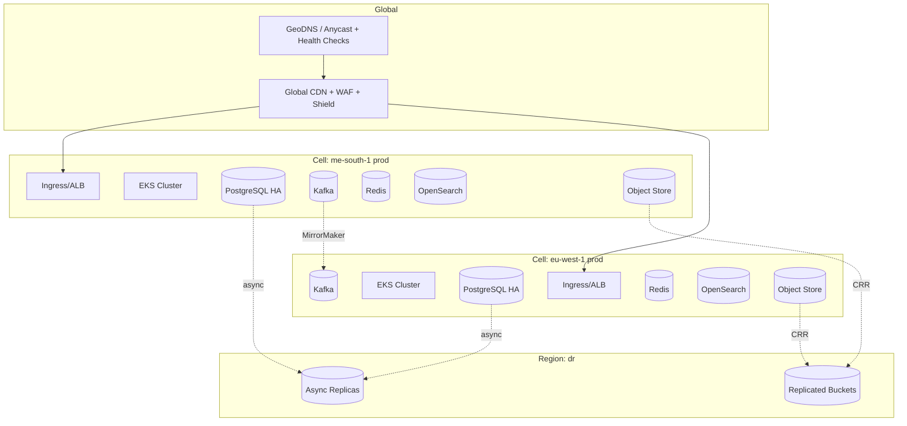
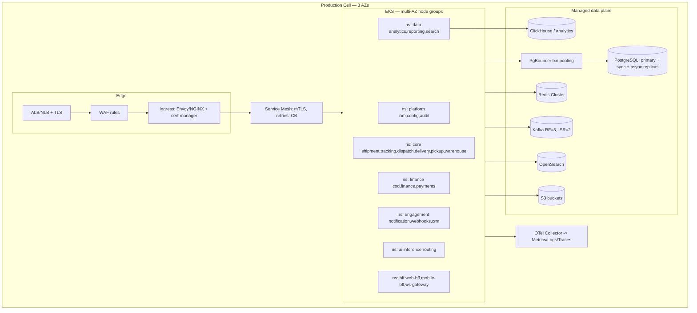
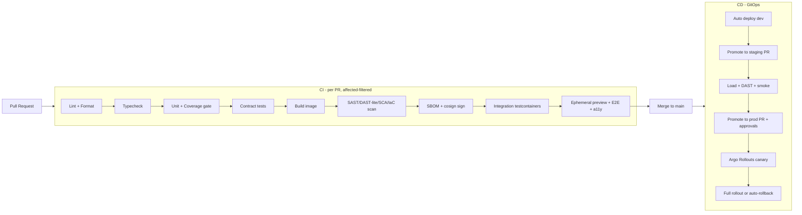
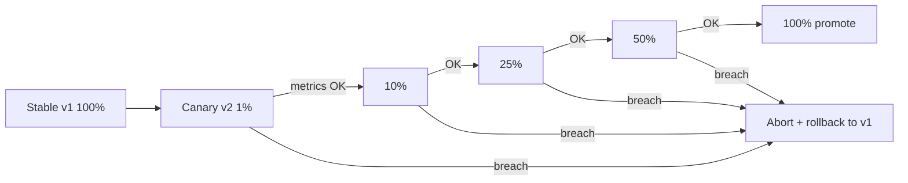

# Livraison — Production Deployment Strategy (v1.0)

> Author hats: Cloud Solutions Architect, DevOps Lead.
> Companion to ARCHITECTURE.md, OPERATIONS.md, IMPLEMENTATION.md, AUDIT.md.
> Audience: Enterprise operations, platform/SRE, security, FinOps.

> Reality note: Sprint 1 (monorepo + design system) is the only code today. This document specifies the **target deployment platform** and the path to it. Cloud examples use AWS; GCP/Azure equivalents are noted where useful. Cost figures are planning-grade estimates, not quotes.

---

## Table of Contents

1. Deployment Principles & Topology Overview
2. Production Environment Architecture
3. Staging (and Lower) Environment Architecture
4. Docker Strategy
5. Kubernetes Deployment Plan
6. CI/CD Pipelines & Deployment Workflows
7. Progressive Delivery: Canary, Blue-Green, Rollback
8. Database Deployment Strategy
9. Cache Deployment Strategy
10. Queue / Event Backbone Deployment Strategy
11. Secrets Management
12. SSL/TLS Strategy
13. CDN Strategy
14. Edge Strategy
15. Environment Variables Structure
16. Scaling Strategy
17. Cost Estimation
18. Deployment Runbook & Go-Live Checklist

---

# 1. Deployment Principles & Topology Overview

## 1.1 Principles

- **GitOps**: Git is the single source of truth. ArgoCD reconciles cluster state from declarative manifests. No `kubectl apply` by humans in prod.
- **Immutable infrastructure**: servers/containers are never patched in place; replaced via new images and IaC.
- **Cell-based per country/region**: blast-radius containment + data residency (ARCHITECTURE.md §1.1, §10.1).
- **Everything as code**: Terraform (cloud), Helm/Kustomize (workloads), policy-as-code (OPA/Gatekeeper).
- **Progressive delivery by default**: canary for services, blue-green for edge/web, phased rollout for mobile.
- **Tiered rigor**: Tier 0 (money/identity) gets stricter gates and zero-loss data posture (OPERATIONS.md §1).

## 1.2 Environment ladder

| Env       | Purpose                              | Data                   | Parity             | Promotion                      |
| --------- | ------------------------------------ | ---------------------- | ------------------ | ------------------------------ |
| `local`   | Dev laptops                          | Seeded fixtures        | Low                | n/a                            |
| `dev`     | Shared integration + PR previews     | Synthetic              | Medium             | Auto on merge to `main`        |
| `staging` | Pre-prod, release gating, load tests | Anonymized prod-shaped | High (prod-parity) | PR-based promotion             |
| `prod`    | Live, cell-per-country               | Real                   | n/a                | PR-based promotion + approvals |
| `dr`      | Disaster recovery                    | Replicas of prod       | High               | Failover only                  |

## 1.3 Global topology



---

# 2. Production Environment Architecture

## 2.1 Per-cell (region) layout



## 2.2 Production characteristics

- **Kubernetes**: managed EKS (or GKE/AKS), control plane HA by provider; worker node groups across ≥ 3 AZs; Karpenter/Cluster Autoscaler.
- **Isolation**: namespace-per-domain; NetworkPolicies default-deny; mesh mTLS (SPIFFE/SPIRE).
- **Data plane**: managed Postgres (RDS/Aurora or Patroni-on-K8s), MSK or Confluent Cloud for Kafka, ElastiCache/Redis, OpenSearch, S3, ClickHouse (managed or self-hosted).
- **Tenancy**: logical multi-tenant within a cell; country pinned to its lawful cell for residency.
- **Ingress**: ALB → Envoy/NGINX ingress with cert-manager; WAF at edge.
- **Observability**: OTel collectors → Mimir/Loki/Tempo (or vendor); 100% trace sampling for finance/auth (OPERATIONS.md §11).

## 2.3 Network design

- VPC per region; private subnets for compute and data; public only for load balancers/NAT.
- Egress via NAT with allowlists; PrivateLink for managed services; no direct public DB exposure.
- Separate route tables/security groups per tier; finance namespaces get stricter egress.

---

# 3. Staging (and Lower) Environment Architecture

## 3.1 Staging

- **Prod-parity**: same Helm charts, same Terraform modules (smaller node counts), same managed services at reduced size.
- **Data**: anonymized, prod-shaped subset (no real PII — AUDIT.md SPEC-003). Refreshed via scrubbed snapshots.
- **Purpose**: release gating, full load tests, DAST, contract tests, DR rehearsal target.
- **Access**: tighter than dev; change controls similar to prod for realistic validation.

## 3.2 Dev + PR previews

- **Dev**: shared cluster; auto-deploy on merge to `main`.
- **PR previews**: ephemeral environments per pull request (namespace + seeded data + preview URL), torn down on merge/close. Web apps get a preview deployment; backend services get a namespaced stack with in-cluster dependencies (or shared dev data plane) using Helm + a per-PR values overlay.

## 3.3 Environment parity matrix

| Concern               | dev     | staging   | prod                    |
| --------------------- | ------- | --------- | ----------------------- |
| Same container images | ✅      | ✅        | ✅ (promoted by digest) |
| Same Helm charts      | ✅      | ✅        | ✅                      |
| Managed DB/Kafka      | small   | medium    | full HA                 |
| Real PII              | ❌      | ❌        | ✅                      |
| Autoscaling           | minimal | prod-like | full                    |
| Approvals to deploy   | none    | light     | required                |

---

# 4. Docker Strategy

## 4.1 Image standards

- **Multi-stage builds**; final stage **distroless** or **chiseled/Wolfi** base; **non-root** user; read-only root filesystem; dropped Linux capabilities.
- One process per container; explicit `HEALTHCHECK` where applicable (probes preferred in K8s).
- Deterministic builds; pinned base image digests (not floating tags).
- `.dockerignore` to keep context minimal; layer ordering for cache efficiency (deps before source).

## 4.2 Image provenance & security

- **SBOM** (Syft, CycloneDX) generated per image.
- **Signed** images (cosign); **SLSA-3** build provenance attestations.
- Scanned (Trivy/Grype) in CI; **admission controllers reject unsigned/untrusted/vulnerable images** (OPERATIONS.md §15.2; closes AUDIT CODE-012 path).
- Stored in a private registry (ECR/Artifact Registry/ACR) with immutability + lifecycle policies.

## 4.3 Tagging & promotion

- Tag by immutable content digest + semantic version + git SHA.
- **Promote by digest** across environments (build once, deploy the exact same artifact dev → staging → prod). Never rebuild per environment.

## 4.4 Frontend specifics

- Next.js apps containerized with standalone output; static assets pushed to CDN at build; server runtime container for SSR/route handlers.
- Mobile (Flutter) is not containerized; built in CI and shipped to app stores (phased rollout).

---

# 5. Kubernetes Deployment Plan

## 5.1 Cluster topology

- One EKS cluster per environment per region. Prod clusters are cell boundaries.
- Node groups: `system` (platform add-ons), `general` (stateless services), `memory-optimized` (search/cache-adjacent), `gpu` (AI inference), `spot` (Tier 3 batch where interruption-tolerant).
- Karpenter for just-in-time node provisioning; Cluster Autoscaler fallback.

## 5.2 Workload manifests (per service)

- **Deployment** (or **StatefulSet** for stateful add-ons), min 3 replicas in prod, spread across AZs.
- **HPA** on CPU + custom metrics (RPS, queue depth); **KEDA** for event-driven consumers (scale on Kafka lag).
- **PodDisruptionBudget** to protect availability during node drains.
- **Topology spread constraints** + pod anti-affinity across AZs.
- **Resource requests/limits** set (no unbounded pods); QoS Guaranteed for Tier 0.
- **Probes**: readiness, liveness, startup; graceful shutdown with `preStop` + `terminationGracePeriodSeconds`.
- **NetworkPolicy**: default-deny; explicit allowlists per dependency.
- **ServiceAccount** with IRSA/Workload Identity (no node-wide cloud creds).

## 5.3 Helm + Kustomize structure

```
infra/
├─ helm/
│  ├─ charts/
│  │  ├─ service-base/        # reusable library chart (probes, HPA, PDB, mesh, OTel)
│  │  └─ <service>/           # thin chart per service depending on service-base
├─ kustomize/
│  ├─ base/
│  └─ overlays/{dev,staging,prod-mea,prod-eu,dr}/
└─ argo/
   ├─ apps/                   # ArgoCD Application/ApplicationSet per env-cell
   └─ projects/               # ArgoCD AppProjects (RBAC boundaries)
```

- A **library chart** (`service-base`) encodes platform standards so each service chart is small and consistent.
- **ApplicationSets** generate ArgoCD apps per (service × env × cell) from a matrix, reducing drift.

## 5.4 Add-ons (platform)

- Ingress (Envoy/NGINX), cert-manager, ExternalDNS, External Secrets Operator, service mesh (Istio/Linkerd), OTel Collector, Prometheus/Mimir, Loki, Tempo, Falco, Gatekeeper/Kyverno, Karpenter, Argo Rollouts, ArgoCD, Strimzi (if self-managed Kafka), Postgres operator (if self-managed).

## 5.5 Multi-tenancy & isolation in-cluster

- Namespace-per-domain; ResourceQuotas + LimitRanges per namespace.
- AppProject RBAC in ArgoCD per team; CODEOWNERS gate manifest changes.
- Finance namespaces: stricter egress NetworkPolicy, dedicated node pool option, Guaranteed QoS.

---

# 6. CI/CD Pipelines & Deployment Workflows

## 6.1 Pipeline overview (build → verify → publish → deploy)



## 6.2 CI stages (mirrors AUDIT.md remediation for CODE-001/002/003/004)

1. Lint (ESLint via shared `packages/eslint-config`) + Prettier check.
2. Typecheck (`tsc`), per language equivalents (Detekt, golangci-lint, mypy/ruff).
3. Unit tests with **coverage thresholds enforced** (≥ 80% lines).
4. Accessibility tests (axe in unit + Storybook test-runner) for web.
5. Contract tests (Pact + OpenAPI/AsyncAPI compatibility against schema registry).
6. Build container; generate SBOM; sign (cosign); push to registry by digest.
7. Security scans: SAST (Semgrep/CodeQL), SCA (Trivy/Snyk), IaC (Checkov), secret scan; vuln gate by severity SLA.
8. Integration tests (Testcontainers: Postgres, Redis, Kafka, OpenSearch).
9. Ephemeral preview env + E2E (Playwright web / Patrol mobile).
10. Publish artifacts with provenance (SLSA-3).

## 6.3 CD workflow (GitOps)

- Merge to `main` updates image digests in the dev overlay → ArgoCD auto-syncs dev.
- Promotion to staging/prod is a **PR that bumps the digest** in the target overlay; required reviewers per environment; prod requires change-approval (and for Tier 0, a second approver).
- ArgoCD syncs the target cell; Argo Rollouts performs canary/blue-green; Flagger/metrics analysis gates progression.
- **Database migrations** run as pre-sync hooks using expand-migrate-contract (backward-compatible), gated behind feature flags.

## 6.4 Pipelines by artifact type

| Artifact          | Build                     | Deploy                | Strategy                            |
| ----------------- | ------------------------- | --------------------- | ----------------------------------- |
| Backend service   | container                 | GitOps → EKS          | Canary (Argo Rollouts)              |
| Web app (Next.js) | container + static to CDN | GitOps → EKS + CDN    | Blue-green at edge + flags          |
| Mobile (Flutter)  | store bundles             | App Store/Play phased | Staged rollout + remote kill switch |
| Infra (Terraform) | plan                      | manual-gated apply    | Plan → approve → apply              |
| Data (dbt)        | build                     | run                   | Tests must pass before publish      |

---

# 7. Progressive Delivery: Canary, Blue-Green, Rollback

## 7.1 Canary (default for backend services)

- Argo Rollouts with traffic steps: **1% → 10% → 25% → 50% → 100%**.
- **Automated analysis** at each step against SLIs: error rate, P95 latency, saturation, and (for finance) correctness invariants. Sourced from Prometheus.
- **Auto-rollback** if any metric breaches its guardrail during a step.
- Bake time per step (e.g., 5–15 min) scaled by tier; Tier 0 uses longer bakes and tighter thresholds.



## 7.2 Blue-Green (edge/web and risky cutovers)

- Two identical environments (blue=current, green=new). Deploy to green, run smoke + synthetic, then switch traffic at ingress/CDN.
- Instant rollback = switch back to blue. Keep blue warm for a defined window before decommissioning.
- Used for Next.js apps and for changes that can't be safely traffic-split (e.g., certain schema-coupled cutovers).

## 7.3 Rollback strategy

- **Service**: ArgoCD revert to previous digest (one PR revert or Rollouts abort); target rollback time < 5 min.
- **Config/flags**: feature-flag kill switch is the fastest mitigation (no redeploy).
- **Database**: never roll back data destructively. Forward-fix or use expand-migrate-contract so old and new code both work during rollout; restores via PITR only for corruption (OPERATIONS.md §9).
- **Mobile**: remote config kill switch disables a feature; store rollback via phased halt + expedited fix (stores don't support instant rollback).
- Every rollback is audited; postmortem if it was incident-driven.

## 7.4 Deployment guardrails

- No prod deploy when the service's error budget is exhausted (freeze policy, OPERATIONS.md §2.5).
- No Friday/peak-window deploys for Tier 0 without explicit approval.
- Migrations and code that depends on them are decoupled (deploy migration first, then code).

---

# 8. Database Deployment Strategy

## 8.1 Engine & topology

- **PostgreSQL 16 + PostGIS**, managed (RDS/Aurora) or Patroni-on-K8s.
- Per region: **primary + synchronous replica (AZ-b) + async replica (AZ-c)**.
- **PgBouncer** in transaction pooling mode in front of every primary; per-service pool caps so autoscaling never exhausts `max_connections` (OPERATIONS.md §6.3).
- **Database-per-service** (or schema-per-service) aligned to bounded contexts; no cross-service FKs.

## 8.2 Tenant isolation enforcement (closes AUDIT SPEC-001)

- RLS default-deny; `tenant_id` on all business tables.
- `SET LOCAL app.tenant_id = $1` inside each transaction (safe under txn pooling).
- A shared data-access wrapper refuses queries without tenant context (fail closed).
- Cross-tenant access tests run in CI per service.

## 8.3 Finance posture (closes AUDIT SPEC-002/SPEC-012)

- Finance cluster: `synchronous_commit = on` + quorum `synchronous_standby_names` → **zero-loss RPO**.
- Ledger append-only, double-entry, with unique business keys + inbox dedupe for exactly-once.

## 8.4 Migrations

- Flyway/Liquibase; forward-only; **expand → migrate → contract**.
- Run as ArgoCD/Helm pre-sync hooks or a gated migration job; never auto-destructive.
- Online schema changes (e.g., `pg_online_schema_change`/`gh-ost`-style for large tables) to avoid long locks.
- Partition management via pg_partman; monthly partitions for `shipments`, etc. (ARCHITECTURE.md §7.6).

## 8.5 Tracking store decision (AUDIT SPEC-007)

- Kafka is the log of record for tracking; queryable history in ClickHouse/Cassandra; compacted "current status" projection in Postgres for transactional reads. Decide in ADR-0005 before building Tracking.

## 8.6 HA/DR & backups

- Patroni auto-failover with fencing; PITR via WAL-G to S3; cross-region async replica for DR.
- Monthly automated restore tests (OPERATIONS.md §10.3).

---

# 9. Cache Deployment Strategy

## 9.1 Redis

- **Cluster mode** (sharded) per region; replicas per shard across AZs; managed (ElastiCache) preferred.
- Use cases: sessions, rate limiting, idempotency keys, hot reads (shipment status), distributed locks (use carefully), ephemeral pub/sub.
- **Eviction**: `allkeys-lru` for pure caches; **separate instances/namespaces** for must-not-evict data (e.g., idempotency keys) with no eviction + persistence.
- Multi-tenant key prefixing `tenant:{id}:...`; per-tenant quotas to prevent noisy-neighbor cache thrash.

## 9.2 Caching layers

- **Edge/CDN** for static + public tracking (short TTL + SWR).
- **In-process near-cache** (bounded LRU) for very hot, read-mostly data, with short TTLs and event-driven invalidation.
- **Redis** as the shared cache tier.
- **Cache invalidation** is event-driven: domain events trigger targeted invalidation/`revalidateTag`.

## 9.3 Failure behavior

- Cache is a performance optimization, never a source of truth: on Redis failure, services degrade to DB reads (with load shedding), not outage.

---

# 10. Queue / Event Backbone Deployment Strategy

## 10.1 Kafka

- Managed (MSK/Confluent Cloud) or Strimzi-on-K8s; **RF=3, min ISR=2**, brokers across 3 AZs.
- Producers: `acks=all`, idempotent; **transactional** producers for financial topics (exactly-once).
- Partitioning by `tenant_id` + business key; hot topics partitioned ≥ 3× consumer count.
- **Schema Registry** (Avro/Protobuf), forward-transitive compatibility; topic naming `domain.entity.event.vN` (ARCHITECTURE.md §9.2).
- Tiered storage for long retention; MirrorMaker for cross-region replication of selected topics.

## 10.2 Consumers & reliability

- Consumer groups scale to partition count; KEDA scales consumers on lag.
- **Inbox pattern** for dedupe; **outbox pattern** for reliable publication from services.
- **Retry topics** with delays (5m/30m/2h) + **DLQ** with diagnostic envelope; replay tooling (ARCHITECTURE.md §9.5).
- Lag SLOs: critical topics < 1 s P95; alert on lag thresholds.

## 10.3 Optional RabbitMQ

- For RPC-style/work-queue jobs (e.g., document rendering, OCR): quorum queues, DLX per queue, bounded consumer concurrency.

---

# 11. Secrets Management

## 11.1 Storage & delivery

- **HashiCorp Vault** and/or cloud secret manager (AWS Secrets Manager) as source of truth; **KMS** for envelope encryption.
- **External Secrets Operator** syncs secrets into K8s; pods consume via mounted files/env from synced secrets (never committed).
- **Dynamic DB credentials** via Vault where supported (short-lived).

## 11.2 Key catalog & rotation (closes AUDIT SPEC-009)

| Secret/key               | Rotation               | Notes                         |
| ------------------------ | ---------------------- | ----------------------------- |
| Service creds (DB)       | ≤ 24 h dynamic         | Vault leases                  |
| API keys                 | ≤ 90 d                 | Self-serve rotation in portal |
| JWT signing (JWKS)       | ≤ 90 d, overlap window | Zero-downtime key rollover    |
| Webhook HMAC             | versioned, on demand   | Old+new valid during rotation |
| POD signing (PKI)        | per policy             | HSM-backed                    |
| DB field-encryption DEKs | per policy             | Per-tenant BYOK option        |
| TLS certs                | ≤ 90 d                 | cert-manager/ACME auto        |

## 11.3 Hygiene

- Pre-commit + CI secret scanning; no secrets in code, env files, or images.
- Access to secrets is least-privilege, audited; break-glass with session recording.

---

# 12. SSL/TLS Strategy

- **TLS 1.2+ (1.3 preferred)** everywhere; modern cipher suites; HSTS; OCSP stapling.
- **Edge**: TLS terminated at CDN/ALB; re-encrypt to ingress (TLS to origin), so traffic is encrypted end-to-end.
- **In-mesh**: **mTLS** via service mesh (SPIFFE/SPIRE identities); auto-rotated certs.
- **Certificate management**: cert-manager with ACME (Let's Encrypt) for public certs; private CA for internal mTLS; certs ≤ 90-day lifetime, auto-renewed.
- **WebSockets** over WSS; HMAC-signed webhooks over HTTPS with versioned secrets.
- **Custom/tenant domains** (white-label public tracking): automated cert issuance per tenant domain via ACME + SNI.

---

# 13. CDN Strategy

- **Global CDN** (CloudFront/Cloudflare/Fastly) in front of static assets and the public tracking app.
- **Cache policy**:
  - Static assets (hashed filenames): long TTL, immutable.
  - Public tracking HTML: short TTL + stale-while-revalidate; personalized/PII responses `Cache-Control: private` (never shared-cached).
  - API JSON: generally not CDN-cached; signed URLs for documents (labels/POD) with short TTL.
- **Invalidation**: tag-based; domain events trigger purges/`revalidateTag` for changed tracking pages.
- **WAF at CDN edge**: OWASP CRS, bot management, rate limiting (critical for public tracking anti-enumeration — AUDIT SPEC-004), DDoS shield.
- **Image optimization** at edge for POD thumbnails/avatars.

---

# 14. Edge Strategy

- **GeoDNS / anycast** with health checks; latency-based routing to the nearest healthy cell; failover records with low TTL.
- **Data residency routing**: customers routed to their lawful region; residency enforced at the edge.
- **Edge compute** (CDN functions / Next.js edge runtime) for lightweight, cacheable, latency-sensitive paths (public tracking lookups, redirects, A/B, locale negotiation) — heavy/PII operations stay in regional origins.
- **Rate limiting & bot protection** at the edge before traffic reaches origins.
- **Static-first** for public surfaces to absorb traffic spikes (Black Friday) without hitting origins.

---

# 15. Environment Variables Structure

## 15.1 Conventions

- `SCREAMING_SNAKE_CASE`, namespaced by service: `SHIPMENT_DB_URL`, `COD_KAFKA_BROKERS`.
- **Config vs secrets separated**: non-sensitive config in ConfigMaps/Helm values; sensitive in External Secrets (never in Git).
- 12-factor: config from environment; no environment-specific code branches.
- Validated at boot (e.g., schema-validated config); service refuses to start on missing/invalid required vars (fail fast).

## 15.2 Standard variable groups (per service)

```
# --- Runtime ---
NODE_ENV / APP_ENV            # dev|staging|prod
SERVICE_NAME                  # shipment-service
SERVICE_VERSION               # injected from CI (git SHA / semver)
REGION                        # me-south-1
CELL                          # prod-mea
LOG_LEVEL                     # info|debug|warn|error

# --- Networking ---
HTTP_PORT
GRPC_PORT
BASE_URL

# --- Datastores (URLs reference pooler, not primary directly) ---
<SVC>_DB_URL                  # via PgBouncer
<SVC>_DB_POOL_MAX
REDIS_URL
OPENSEARCH_URL
OBJECT_STORE_BUCKET

# --- Eventing ---
KAFKA_BROKERS
KAFKA_SCHEMA_REGISTRY_URL
KAFKA_CONSUMER_GROUP

# --- Security (values from secret manager) ---
OIDC_ISSUER_URL
JWKS_URL
JWT_AUDIENCE
KMS_KEY_ID                    # reference, not key material

# --- Observability ---
OTEL_EXPORTER_OTLP_ENDPOINT
OTEL_SERVICE_NAME
OTEL_TRACES_SAMPLER           # finance/auth -> always_on

# --- Tenancy / Flags ---
DEFAULT_TENANT_RESOLUTION     # from-token
FEATURE_FLAGS_SDK_KEY         # secret
```

## 15.3 Sourcing precedence

1. Helm values (per overlay: dev/staging/prod-cell) → ConfigMap.
2. External Secrets → Secret (sensitive).
3. Pod spec env references both.
4. No `.env` files in production; `.env.example` only for local dev.

---

# 16. Scaling Strategy

## 16.1 Compute (stateless)

- HPA on CPU + custom metrics (RPS, P95 latency proxy); KEDA on Kafka consumer lag.
- Karpenter provisions nodes just-in-time; spot for Tier 3 interruption-tolerant workloads.
- Min 3 replicas/AZ for Tier 0/1; scale-out reaction target < 60 s.

## 16.2 Data

- Postgres: read replicas for read scaling; partitioning; tenant sharding when a cell outgrows a single primary.
- Kafka: add partitions/brokers for hot topics; tiered storage for retention.
- Redis: add shards; near-cache for hottest keys.
- OpenSearch/ClickHouse: add nodes; hot-warm-cold tiers.

## 16.3 Predictive & scheduled scaling

- Pre-scale (scheduled HPA min bumps) ahead of known peaks (sales/holidays).
- Demand forecasting (AI) feeds capacity planning (BLUEPRINT.md §11.5).

## 16.4 Load shedding & protection

- Per-tenant quotas + rate limits; 429 + Retry-After end-to-end.
- Shed Tier 3 before Tier 1; always protect Tier 0.

## 16.5 Scaling triggers (summary)

| Resource        | Scale-out trigger          | Ceiling alert           |
| --------------- | -------------------------- | ----------------------- |
| Stateless pods  | CPU > 65% or RPS/lag SLI   | 85% node capacity       |
| Kafka consumers | lag > threshold            | partition count reached |
| Postgres        | replica CPU / read latency | connections > 80%       |
| Redis           | memory > 70% / latency     | shard memory ceiling    |

---

# 17. Cost Estimation

> Planning-grade ranges (USD/month), order-of-magnitude, single primary region unless noted. Real costs depend on negotiated rates, reserved/savings plans, traffic, and data volumes. Use as a budgeting starting point, not a quote.

## 17.1 MVP (single region, closed beta — IMPLEMENTATION.md M1)

| Category                | Components                           | Est. /mo          |
| ----------------------- | ------------------------------------ | ----------------- |
| Kubernetes compute      | 1 EKS + ~15–25 nodes (mixed)         | $8k–$18k          |
| PostgreSQL              | 1 primary + 2 replicas (managed)     | $3k–$7k           |
| Kafka                   | 3 brokers (MSK/Confluent)            | $2k–$5k           |
| Redis                   | cluster, modest                      | $1k–$2.5k         |
| OpenSearch              | 3 nodes                              | $1.5k–$3k         |
| Object storage + egress | low volume                           | $0.5k–$2k         |
| CDN + WAF               | moderate                             | $1k–$3k           |
| Observability           | metrics/logs/traces (vendor or self) | $2k–$6k           |
| Secrets/KMS, misc       |                                      | $0.5k–$1.5k       |
| **Subtotal**            |                                      | **~$20k–$48k/mo** |

## 17.2 Growth (multi-city, larger volumes — M3/M4)

| Category                                  | Note                         | Est. /mo           |
| ----------------------------------------- | ---------------------------- | ------------------ |
| Compute                                   | autoscaled, higher baseline  | $30k–$80k          |
| Data plane (PG/Kafka/Redis/OS/ClickHouse) | bigger + analytics           | $25k–$70k          |
| CDN/WAF/edge                              | higher traffic               | $5k–$20k           |
| Observability                             | higher cardinality/retention | $8k–$25k           |
| AI/GPU                                    | inference + training         | $5k–$30k           |
| **Subtotal**                              |                              | **~$75k–$225k/mo** |

## 17.3 Enterprise / multi-region (M7–M8)

- Multiply core data + compute by number of active cells; add cross-region replication egress (can be significant), DR standby capacity, and 24/7 support tooling. Plan **$250k–$1M+/mo** depending on regions, volume (toward 1M shipments/day), and AI footprint.

## 17.4 FinOps practices

- Tag everything (team/tenant/service/env) for cost allocation.
- **Cost-per-shipment** as a tracked unit metric; alert on regressions.
- Reserved Instances/Savings Plans for steady baseline; spot for batch/Tier 3.
- Rightsizing reviews monthly; storage lifecycle to cold tiers; log retention tuning (often the silent cost driver).
- Budget alerts + anomaly detection; per-cell budget ownership.

---

# 18. Deployment Runbook & Go-Live Checklist

## 18.1 Standard release flow

1. PR merged → CI green (lint/type/test/coverage/contract/scan/E2E).
2. Image built once, signed, SBOM attached, pushed by digest.
3. Auto-deploy to dev (ArgoCD).
4. Promotion PR to staging → load/DAST/smoke pass.
5. Promotion PR to prod cell(s) → required approvals (2 for Tier 0).
6. DB migration pre-sync hook (expand) if needed.
7. Argo Rollouts canary with automated analysis → promote or auto-rollback.
8. Post-deploy synthetic checks + dashboards watched through bake.
9. Release notes + changelog; on-call informed.

## 18.2 Go-Live checklist (per cell)

- [ ] Production Readiness Gate passed for all in-scope services (OPERATIONS.md §16).
- [ ] DNS/anycast + CDN + WAF configured and tested.
- [ ] TLS certs issued (incl. tenant custom domains); auto-renew verified.
- [ ] Secrets present via External Secrets; rotation tested.
- [ ] DB HA verified; PITR + restore test passed; finance zero-loss replication confirmed.
- [ ] Kafka RF=3/ISR=2; schema registry compatibility set; DLQ/retry topics created.
- [ ] Autoscaling (HPA/KEDA/Karpenter) validated under load test.
- [ ] Observability: dashboards, SLO alerts, synthetic checks live.
- [ ] Backups + immutable (WORM) backups configured.
- [ ] DR runbook present and rehearsed for Tier 0/1.
- [ ] Rollback path tested (canary abort + flag kill switch).
- [ ] Data residency correct for the cell's countries.
- [ ] Security: image signing admission, network policies, WAF rules, pen-test findings closed.
- [ ] Cost tags + budget alerts configured.

## 18.3 Emergency change (hotfix) flow

- Fast-track CI (full security scans still required), expedited approval, canary still enforced for Tier 0 unless an active SEV1 mitigation justifies a documented exception (recorded in the incident).

---

## Appendix A — Tooling Summary

- IaC: Terraform; Workloads: Helm + Kustomize; GitOps: ArgoCD; Progressive delivery: Argo Rollouts (+ Flagger metrics).
- Registry: ECR/Artifact Registry/ACR; Signing: cosign; SBOM: Syft; Scans: Trivy/Semgrep/Checkov.
- Mesh: Istio/Linkerd; Ingress: Envoy/NGINX; Certs: cert-manager; Secrets: Vault + External Secrets + KMS.
- Data: PostgreSQL/PostGIS, Kafka (MSK/Confluent/Strimzi), Redis (ElastiCache), OpenSearch, ClickHouse, S3.
- Observability: OpenTelemetry, Prometheus/Mimir, Loki, Tempo, Grafana, Sentry.
- CI: GitHub Actions / GitLab CI with Turborepo affected-filtering.

## Appendix B — Document Maintenance

- Owner: DevOps Lead + SRE. Review quarterly and after any major infra change or SEV1.
- All infra changes via PR with platform + security review; costs re-baselined quarterly.

— End of Deployment Strategy —
