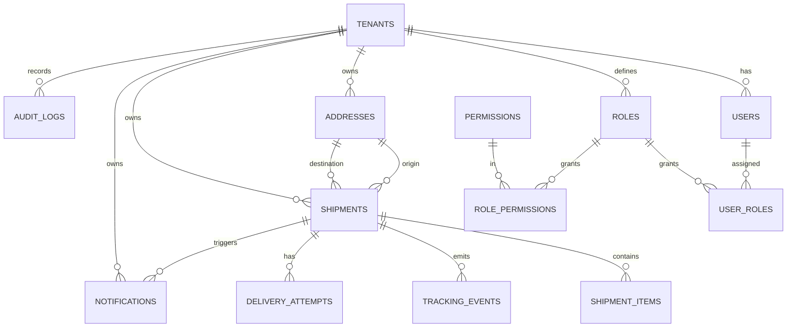

# Livraison Core Database — Documentation

PostgreSQL 16 data layer for the Livraison platform. This document is the data dictionary, ERD, and operational reference. The schema and all behaviors described here were verified against a live PostgreSQL 16 instance.

## 1. Conventions

- **Primary keys**: `UUID`, defaulted by the database via `gen_random_uuid()` (from the `pgcrypto` extension). Applications may also supply UUIDv7 for time-ordering.
- **Naming**: `snake_case` tables (plural) and columns. Foreign keys named `<table>_<column>_fkey`.
- **Timestamps**: `TIMESTAMPTZ(6)`, UTC. `created_at` defaults to `CURRENT_TIMESTAMP`; `updated_at` is maintained by both the ORM and a DB trigger.
- **Money**: `DECIMAL(19,4)` plus a `CHAR(3)` ISO-4217 currency.
- **Geo**: `DECIMAL(9,6)` latitude/longitude.
- **JSON**: `JSONB` for flexible `config`/`metadata`/`payload`, with GIN indexes where filtered.

## 2. Multi-tenancy & isolation

Every tenant-owned table carries `tenant_id UUID`. Isolation is enforced at two layers (defense in depth):

1. **Application**: services always filter by the authenticated tenant.
2. **Database (RLS)**: Row-Level Security policies restrict every row to the tenant in the session GUC `app.tenant_id`.

### RLS enforcement contract

- The application connects as the **non-privileged** role `livraison_app` (RLS is bypassed by table owners/superusers, so the app must not use one).
- Each request sets the tenant **inside its transaction**:
  ```sql
  SET LOCAL app.tenant_id = '<tenant-uuid>';
  ```
  `SET LOCAL` is required so the setting is scoped to the transaction and is safe under PgBouncer **transaction** pooling.
- `current_tenant_id()` returns `NULL` when the GUC is unset, so policies **fail closed**: with no tenant context, **zero** tenant rows are visible.
- Policies use both `USING` (read/visibility) and `WITH CHECK` (write) so a session cannot read or write across tenants.

### Verified behavior (live test)

- Tenant A context → sees only tenant A rows.
- Tenant B context → sees only tenant B rows.
- No context → `SELECT count(*)` returns `0` (fail-closed).

## 3. Soft deletes

- Tables carry `deleted_at TIMESTAMPTZ` (and audit `deleted_by`). Rows are archived, not physically removed, except where cascade integrity requires it.
- **Uniqueness ignores soft-deleted rows** via partial unique indexes:
  - `ux_tenants_slug_active` — unique `slug` among non-deleted tenants.
  - `ux_users_tenant_email_active` — unique `(tenant_id, lower(email))` among non-deleted users.
  - `ux_roles_scope_key_active` — unique role `key` per tenant scope (NULL tenant = platform scope).
  - `ux_shipments_awb_active` — globally unique `awb` among non-deleted shipments.
- Append-only tables (`tracking_events`, `audit_logs`) have **no** `deleted_at`; they are never soft-deleted.

## 4. Audit fields

Mutable tables include `created_at`, `updated_at`, `created_by`, `updated_by`, `deleted_at`, `deleted_by`. `updated_at` is enforced by the `set_updated_at()` trigger (migration `0004`) so it advances even on raw SQL updates (verified: `updated_at > created_at` after an UPDATE).

## 5. Entity-Relationship overview



## 6. Data dictionary (key columns)

### tenants

Platform customer/organization. `slug` (unique active), `name`, `status` (ACTIVE/SUSPENDED/ARCHIVED), `config` JSONB. Indexed on `status`.

### users

Staff/principals scoped to a tenant. `email` (unique active per tenant), `password_hash` (Argon2id, set by the identity service), `status`, `last_login_at`. Indexed on `(tenant_id, status)` and `(tenant_id, email)`.

### roles

RBAC roles. `tenant_id` NULL = platform/system role; otherwise tenant-scoped. `key`, `name`, `is_system`. RLS: tenant roles isolated; platform roles readable by all, writable only by the privileged role.

### permissions

Global permission catalog. `key` (unique), `resource`, `action`. Reference data (not tenant-scoped).

### user_roles / role_permissions

Junction tables (composite PKs). Cascade-delete with their parents; isolation inherited from parent visibility.

### addresses

Reusable addresses. `type` (SENDER/RECIPIENT/PICKUP/RETURN/BRANCH/WAREHOUSE), contact, `line1/line2/city/region/postal_code`, `country_code` (CHAR 2), lat/long, `metadata`. Indexed on `(tenant_id, type)` and `(tenant_id, country_code, city)`; GIN on `metadata`.

### shipments

The unit of work. `awb` (unique active), `merchant_id`, `origin_id`/`destination_id` (RESTRICT delete to protect referenced addresses), `status` (16-state lifecycle), `service`, `cod_amount`, `declared_value`, `currency`, `weight_grams`, `reference`. `created_by` → users (SET NULL on user delete). Indexed on `(tenant_id, status, created_at)`, `(tenant_id, merchant_id, created_at)`, `(tenant_id, service)`; GIN on `metadata`.

### shipment_items

Line items per shipment. `description`, `sku`, `quantity`, `weight_grams`, `unit_value`, `hs_code`. Cascade-delete with shipment.

### tracking_events

Append-only journey events. `type`, `source`, geo, `occurred_at`, `actor_id`, `payload`. Indexed on `(tenant_id, shipment_id, occurred_at)`, `(shipment_id, occurred_at)`, `type`. No soft delete.

### delivery_attempts

Per-attempt records. Unique `(shipment_id, attempt_no)`, `outcome`, `reason_code`, `driver_id`, geo, POD signature/photo. Indexed on `(tenant_id, shipment_id)` and `driver_id`.

### notifications

Outbound messages. `channel`, `status`, `recipient`, `template`, `locale`, `payload`, `sent_at`/`failed_at`/`error`. `shipment_id` SET NULL on shipment delete. Indexed on `(tenant_id, status)`, `(tenant_id, channel, created_at)`, `shipment_id`; partial index on QUEUED rows.

### audit_logs

Append-only audit trail. `actor_id`, `actor_type`, `action`, `resource_type`, `resource_id`, `before`/`after` JSONB, `ip_address`, `user_agent`, `request_id`, `occurred_at`. `tenant_id` SET NULL on tenant delete to preserve history. Indexed on `(tenant_id, occurred_at)`, `(actor_id, occurred_at)`, `(resource_type, resource_id)`.

## 7. Indexing rationale

- **Composite indexes** lead with `tenant_id` to match the tenant-scoped query pattern enforced by RLS.
- **Partial indexes** on `deleted_at IS NULL` keep active-row scans small and back soft-delete-aware uniqueness.
- **GIN** on `metadata` enables JSONB containment filters.
- **Append-only** tables order on `occurred_at` for time-range tracking queries.
- Future scale: `shipments` and `tracking_events` are partitioning candidates (range by `created_at`/`occurred_at`, hash by `tenant_id`) — see ARCHITECTURE.md §7.6.

## 8. Referential integrity (delete behavior)

- `tenant` deletes cascade to owned rows; `audit_logs.tenant_id` and `notifications.shipment_id` use SET NULL to retain records.
- `shipments.origin_id/destination_id` use **RESTRICT** so an address in use cannot be deleted out from under a shipment.
- `shipments.created_by` uses SET NULL so removing a user does not erase shipment history.

## 9. Roles & runtime credentials

- **Migration/owner role** (e.g., `livraison`): runs migrations and seeds; bypasses RLS.
- **Application role** `livraison_app`: NOLOGIN by default (grant LOGIN + password out of band/secrets manager); has DML grants only; subject to RLS. Runtime services must use this role.

## 10. Operational notes

- Apply migrations with `prisma migrate deploy` (CI/prod); never edit applied migrations.
- Backups/PITR and partitioning are covered in OPERATIONS.md and ARCHITECTURE.md.
- The seed is idempotent (safe to re-run): permissions/roles/junctions upsert; tenant/user/sample-shipment guard on existing rows.
- Default seeded admin: `admin@demo.local` / `ChangeMe!2026` (demo only — rotate immediately; never use in non-dev environments).
